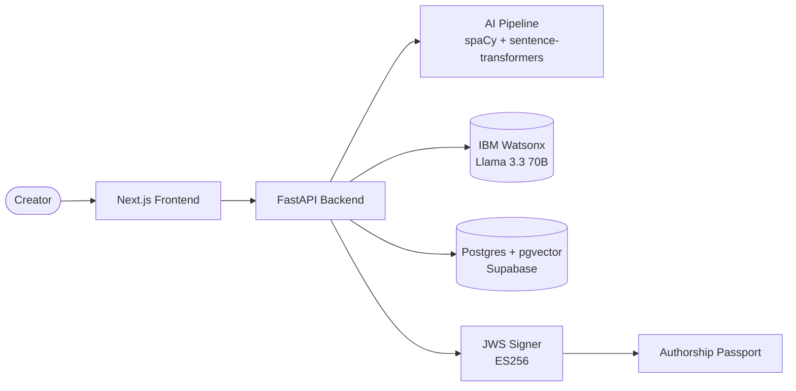

# AutorIA — Your Authorial Voice, Preserved by AI

[](LICENSE)
[](https://ibm.biz/university-bob)
[](https://www.ibm.com/products/watsonx-ai)
[](https://www.python.org/)
[](https://nextjs.org/)
[](https://fastapi.tiangolo.com/)
[](https://github.com/pgvector/pgvector)
[](https://aibuilderschallenge-bob.bemyapp.com)

> AutorIA learns an author's stylistic DNA from their prior work, generates AI assistance that preserves their voice, and issues a cryptographically signed **Authorship Passport** documenting what was AI, what was human, and what sources were referenced — complying with **EU AI Act Article 50**.

---

## 🎬 Demo

> _Coming July 31. This section will hold the YouTube video and the public deploy URL._

- **Live demo**: <!-- https://autoria.vercel.app -->
- **3-min video**: <!-- https://youtu.be/... -->
- **Authorship Passport verifier**: <!-- https://autoria.vercel.app/verify -->

---

## ❓ The Problem

When a writer uses generative AI for assistance, **something is lost: their voice**. ChatGPT, Claude, Llama — they all write in the same averaged tone, optimized to please everyone. The result is aesthetic conformism in a field that lives off distinctiveness.

And starting **August 2026**, [EU AI Act Article 50](https://artificialintelligenceact.eu/article/50/) mandates that AI-generated or AI-assisted content be clearly identified, with traceable records. Creators, agencies and publishers have **no standard solution** for disclosing and verifying AI use today.

---

## 💡 Our Solution

AutorIA is the authorship layer for AI-assisted creators. Three pieces:

1. **Style DNA Extraction** — ingest an author's corpus, extract a quantifiable `StyleProfile` (lexical, syntactic, stylistic, semantic).
2. **Conditioned Generation** — given a prompt, generate text that preserves the author's voice (compared side-by-side with the vanilla model output).
3. **Authorship Passport** — every generation is bundled with a cryptographically signed JSON manifest, verifiable by anyone with the public key.

---

## 🗺️ Challenge Theme Alignment

> _"Reimagine Creative Industries with AI"_ — AI Builders Challenge, July 2026.

AutorIA helps individual creators **preserve their authentic voice** when using AI, instead of being homogenized by averaged-out LLM outputs. And it gives the creative industry — agencies, publishers, regulators — the **technical infrastructure** needed to comply with the EU AI Act's disclosure requirements.

| Criterion               | How AutorIA delivers                                                                                                                         |
| ----------------------- | -------------------------------------------------------------------------------------------------------------------------------------------- |
| **Technical Execution** | Full AI pipeline (spaCy + sentence-transformers + Watsonx) + real cryptographic signing (JWS ES256) + Postgres + pgvector with HNSW indexing |
| **Innovation**          | The "auditable authorship" layer is novel — almost nobody is building this in time for EU AI Act                                             |
| **Feasibility**         | Focused MVP, mainstream stack, verifiable demo, clear path to scale                                                                          |
| **Challenge Fit**       | Solves a concrete, named, urgent problem in a creative industry                                                                              |
| **Real-World Impact**   | EU AI Act creates urgent demand (€14B AI-assisted creative market, August 2026 deadline)                                                     |

---

## 🏗️ Architecture

See **[docs/architecture.md](docs/architecture.md)** for the full C4 diagrams (Context, Container, Component) and sequence diagrams.

High-level:



---

## 🧬 How It Works — AI Pipeline

The `StyleProfile v1.0` captures an author's stylistic DNA across four orthogonal layers:

| Layer                      | Examples                                                          | File                                             |
| -------------------------- | ----------------------------------------------------------------- | ------------------------------------------------ |
| **Lexical**                | Type-Token Ratio, MATTR-500, hapax ratio, avg word length         | `ai_pipeline/autoria_ai/extractor/lexical.py`    |
| **Syntactic**              | Sentence length distribution, subordination ratio, dep-tree depth | `ai_pipeline/autoria_ai/extractor/syntactic.py`  |
| **Stylistic**              | Punctuation & POS distribution, discourse markers                 | `ai_pipeline/autoria_ai/extractor/stylistic.py`  |
| **Distinctive Vocabulary** | Top-50 TF-IDF terms vs reference corpus                           | `ai_pipeline/autoria_ai/extractor/vocabulary.py` |
| **Semantic**               | Author centroid (768-dim) + UMAP 2D projection                    | `ai_pipeline/autoria_ai/embedder.py`             |

Full feature spec → **[docs/style_features.md](docs/style_features.md)**.

When the user prompts a generation, the system runs **two parallel Watsonx calls**: one vanilla and one conditioned on the StyleProfile + RAG passages. Both outputs are scored against the target StyleProfile via a 5-component weighted `fit_score`. The conditioned generation is then bundled into a signed **Authorship Passport** (see **[docs/passport_schema.md](docs/passport_schema.md)**).

---

## 🔐 The Authorship Passport

Every generation emits a JSON manifest signed with **JWS (ES256)**, containing:

- Hash of the input prompt (privacy-preserving)
- Hash of the output text (tamper-evident)
- Model identifier and parameters
- Hashes of the RAG source passages used
- AI / human contribution percentages
- `fit_score` against the target StyleProfile

The signature can be verified **publicly and offline** against the AutorIA public key at `/.well-known/jwks.json` — no AutorIA service required.

→ Full spec: **[docs/passport_schema.md](docs/passport_schema.md)**.

---

## 🤖 How We Used IBM Bob

> ⚠️ **This is THE most important section for IBM judges.** It will be completed in Sprint 3 (Jul 22–28) with screenshots, metrics, and BobShell exports.

We built AutorIA in 30 days with IBM Bob as our main copilot. Four Custom Modes — one per owner plus a shared crypto mode — orchestrated different parts of the development cycle:

| Custom Mode             | Purpose                                                                                  | Doc                                                                                    |
| ----------------------- | ---------------------------------------------------------------------------------------- | -------------------------------------------------------------------------------------- |
| **StyleExtractor**      | Building the linguistic feature extractor with spaCy                                     | [`bob/custom-modes/style-extractor.md`](bob/custom-modes/style-extractor.md)           |
| **GenerationConductor** | RAG retrieval, conditioned-prompt composition, Watsonx orchestration, `fit_score` tuning | [`bob/custom-modes/generation-conductor.md`](bob/custom-modes/generation-conductor.md) |
| **StudioComposer**      | Style DNA viz, side-by-side UI, `/verify` screen, API contract alignment, i18n           | [`bob/custom-modes/studio-composer.md`](bob/custom-modes/studio-composer.md)           |
| **PassportAuditor**     | Designing and verifying the JWS-signed Passport                                          | [`bob/custom-modes/passport-auditor.md`](bob/custom-modes/passport-auditor.md)         |

Weekly BobShell session exports for each team member live in **[`bob/sessions/`](bob/sessions/)** (created on the first Friday of Sprint 1, July 10).

The complete Bob usage report (metrics + screenshots + analysis) lives in **[`bob/usage-report.md`](bob/usage-report.md)**.

Our team's operational playbook for using Bob — prompt patterns, export workflow, anti-patterns — lives in **[`bob/playbook.md`](bob/playbook.md)**.

---

## ⚙️ Tech Stack

| Layer           | Tech                                                                                                   | Why                                                                             |
| --------------- | ------------------------------------------------------------------------------------------------------ | ------------------------------------------------------------------------------- |
| **Frontend**    | Next.js 14 (App Router) + TypeScript + Tailwind + shadcn/ui + Recharts                                 | Modern React, fast static + SSR, great DX for visualizations                    |
| **Backend**     | FastAPI + Python 3.11 + Pydantic v2 + SQLAlchemy 2 + asyncpg                                           | Async by default, type-safe, fits a Python AI pipeline natively                 |
| **AI Pipeline** | spaCy 3.7 (`en_core_web_lg`) + sentence-transformers (`all-mpnet-base-v2`) + scikit-learn + umap-learn | Industry-standard English NLP; strong 768-dim semantic embeddings; reproducible |
| **LLM**         | IBM Watsonx (Llama 3.3 70B + Granite 3 8B)                                                             | End-to-end IBM stack; full-IBM points; strong creative English generation       |
| **Database**    | PostgreSQL 16 + pgvector (Supabase)                                                                    | Single DB for relational + vector; HNSW index for fast RAG                      |
| **Crypto**      | python-jose, ES256 (ECDSA P-256)                                                                       | Standard JWS; small signatures; native browser verification                     |
| **Hosting**     | Vercel (frontend) + Railway (backend) + Supabase (DB)                                                  | Zero-ops, free or near-free tiers, push-to-deploy                               |
| **Dev tools**   | IBM Bob + GitHub + GitHub Projects + GitHub Actions + Docker Compose                                   | Bob is mandatory; the rest is best-in-class CI/CD for this size                 |

---

## 🚀 Getting Started (Local Setup)

Prerequisites: **Python 3.11**, **Node 20+**, **Docker Desktop**.

```bash
# 1. Clone
git clone https://github.com/sergi-torres/AuthorAI.git
cd autorIA

# 2. Copy env template and fill in real values (Watsonx API key, etc.)
cp .env.example .env

# 3. Install all dependencies
make install

# 4. Generate Authorship Passport signing keypair (one-time)
make keys

# 5. Start local Postgres + pgvector
make db-up

# 6. Seed the database with the 3 preloaded authors
make seed

# 7. Start backend + frontend (parallel)
make dev
# Frontend: http://localhost:3000
# Backend:  http://localhost:8000  (docs at /docs)
```

To run the AI pipeline end-to-end on the seeded corpus without the web stack:

```bash
make demo
```

---

## 🗂️ Repository Structure

```
autorIA/
├── ai_pipeline/         # CORE — feature extraction, generation, passport (P2 owner)
├── backend/             # FastAPI app + routes + DB layer (P3 owner)
├── frontend/            # Next.js 14 app (P1 owner)
├── bob/                 # IBM Bob workspace: Custom Modes + sessions + report
├── corpus/              # Demo texts (Austen, Dickens, Poe)
├── docs/                # MVP, decision log, architecture, schemas, sprint plan
├── infra/               # Supabase SQL migrations
├── scripts/             # seed, run_demo, generate_keys, etc.
├── .github/             # CI workflow, PR & issue templates
├── docker-compose.yml   # Local Postgres + pgvector
├── Makefile             # Common commands
└── README.md            # ← you are here
```

---

## 🗺️ Roadmap (post-July)

- **v1.1** — human-edit tracking + real human/AI contribution percentage in Passport
- **v1.2** — multi-step Passport (chains of generations)
- **v2.0** — multimodal (images and audio) + W3C Verifiable Credentials format
- **v2.x** — collaborative voices, voice marketplace, plug-ins for major writing apps

---

## 🙏 Acknowledgments

- **IBM Bob** — our development copilot.
- **IBM Watsonx** — LLM infrastructure.
- **BeMyApp** — challenge organizers.
- **Project Gutenberg** — public-domain corpus source (Austen, Dickens, Poe).
- Open-source libraries that made this possible: **spaCy**, **sentence-transformers**, **FastAPI**, **Next.js**, **pgvector**, **python-jose**, **shadcn/ui**, **Recharts**, **UMAP**.

---

## 👥 Team

|     | Name           | Role                             | GitHub                                      | LinkedIn                                              |
| --- | -------------- | -------------------------------- | ------------------------------------------- | ----------------------------------------------------- |
| P1  | Sergi Torres   | Frontend + Pitch + Bob Champion  | [sergi-torres](https://github.com/sergi-torres) | [LinkedIn](https://www.linkedin.com/in/storres-dev/)  |
| P2  | David Muñoz    | AI/ML Engineer                   | [Davisuco28](https://github.com/Davisuco28)   | [LinkedIn](https://www.linkedin.com/in/dmunoz-dev/)   |
| P3  | Pablo Chaume   | Backend + AI Generation + Crypto | [PabloVc-77](https://github.com/PabloVc-77) | [LinkedIn](https://www.linkedin.com/in/pablo-v-chaume-magraner/) |

---

## 📜 License

MIT — see [LICENSE](LICENSE).
