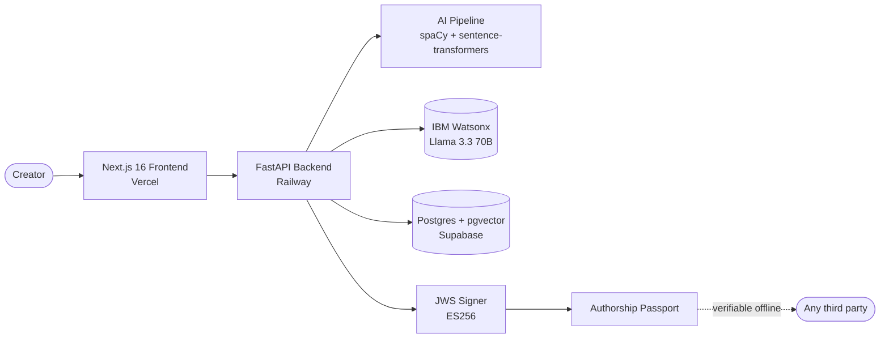

<div align="center">

# AutorIA — Your Authorial Voice, Preserved by AI

**Style DNA extraction · Voice-conditioned generation · Cryptographically signed Authorship Passports**

[](https://youtu.be/V1r2oZ6dFB0)
[](https://quebasto.com/)
[](https://quebasto.com/verify)

[](LICENSE)
[](https://ibm.biz/university-bob)
[](https://www.ibm.com/products/watsonx-ai)
[](https://www.python.org/)
[](https://nextjs.org/)
[](https://fastapi.tiangolo.com/)
[](https://github.com/pgvector/pgvector)
[](https://aibuilderschallenge-bob.bemyapp.com)

</div>

> AutorIA learns an author's stylistic DNA from their prior work, generates AI assistance that **preserves their voice**, and issues a cryptographically signed **Authorship Passport** documenting what was AI, what was human, and what sources were referenced — the technical substrate for **EU AI Act Article 50**.

---

## 🎬 Try it

| | |
| --- | --- |
| **▶ 3-min video** | **<https://youtu.be/V1r2oZ6dFB0>** — *AutorIA: Verifiable Literary AI powered by IBM watsonx* |
| **Live app** | **<https://quebasto.com/>** — pick a voice, prompt it, compare, download a Passport |
| **Passport verifier** | **<https://quebasto.com/verify>** — paste any Passport token, no account needed |
| **Public API** | **<https://api.quebasto.com>** — [`/health`](https://api.quebasto.com/health) · [`/api/authors`](https://api.quebasto.com/api/authors) · [`/.well-known/jwks.json`](https://api.quebasto.com/.well-known/jwks.json) |

Every link above was exercised end to end on **2026-07-31** — the numbers in [§ Proof it works](#-proof-it-works-real-output-from-the-live-api) are that run's real output, not a mock-up.

<details>
<summary><b>📋 Table of contents</b></summary>

- [The problem](#-the-problem)
- [Our solution](#-our-solution)
- [Proof it works](#-proof-it-works-real-output-from-the-live-api)
- [The 90-second demo](#-the-90-second-demo)
- [Challenge theme alignment](#️-challenge-theme-alignment)
- [Architecture](#️-architecture)
- [How it works — the AI pipeline](#-how-it-works--the-ai-pipeline)
- [The Authorship Passport](#-the-authorship-passport)
- [How we used IBM Watsonx](#-how-we-used-ibm-watsonx)
- [How we used IBM Bob](#-how-we-used-ibm-bob)
- [Tech stack](#️-tech-stack)
- [Getting started (local setup)](#-getting-started-local-setup)
- [Repository structure](#️-repository-structure)
- [Engineering practices](#-engineering-practices)
- [Status and honest limitations](#-status-and-honest-limitations)
- [Roadmap](#️-roadmap-post-july)
- [Acknowledgments](#-acknowledgments) · [Team](#-team) · [License](#-license)

</details>

---

## ❓ The Problem

When a writer uses generative AI for assistance, **something is lost: their voice**. ChatGPT, Claude, Llama — they all converge on the same averaged tone, optimized to please everyone. The result is aesthetic conformism in a field that lives off distinctiveness.

And from **August 2026**, [EU AI Act Article 50](https://artificialintelligenceact.eu/article/50/) requires AI-generated or AI-assisted content to be clearly identified, with traceable records. Creators, agencies and publishers have **no standard way** to disclose and verify AI use today — the obligation lands next month and the tooling does not exist.

---

## 💡 Our Solution

AutorIA is the **authorship layer** for AI-assisted creators. Three pieces, all shipped:

| | What it does | Where it lives |
| --- | --- | --- |
| **1 · Style DNA extraction** | Ingest an author's corpus; compute a quantifiable `StyleProfile v1.0` — lexical, syntactic, stylistic, distinctive vocabulary, semantic | [`ai_pipeline/autoria_ai/extractor/`](ai_pipeline/autoria_ai/extractor/) |
| **2 · Voice-conditioned generation** | Given a prompt, run **two Watsonx calls in parallel** — one vanilla, one conditioned on the StyleProfile + RAG passages — and score both against the target voice | [`ai_pipeline/autoria_ai/generator.py`](ai_pipeline/autoria_ai/generator.py) |
| **3 · Authorship Passport** | Bundle each generation into a **JWS ES256-signed** JSON manifest, verifiable by anyone, offline, against a public key | [`ai_pipeline/autoria_ai/passport/`](ai_pipeline/autoria_ai/passport/) |

The comparison is deliberately **honest**: both columns call the *same* model (`llama-3-3-70b-instruct`). The only variable is our conditioning — so any difference the jury sees is earned, never staged.

---

## 🔬 Proof it works (real output from the live API)

Run this yourself right now — no install, no key:

```bash
curl -s -X POST https://api.quebasto.com/api/generate \
  -H "Content-Type: application/json" \
  -d '{"author_id":"dickens","prompt":"A foggy London evening in the 1840s, seen from a window."}'
```

**Measured on 2026-07-31, one cold call from a laptop in Spain:**

| Check | Result |
| --- | --- |
| End-to-end latency (both generations, parallel) | **7.73 s** — inside the < 8 s P95 target of [`docs/MVP.md`](docs/MVP.md) §4.3 |
| `fit_score` — vanilla Llama 3.3 70B | **49 / 100** |
| `fit_score` — AutorIA, same model + Dickens conditioning | **66 / 100** |
| RAG passages retrieved from the real Dickens corpus | **5**, via pgvector HNSW |
| Passport issued and signed | ✅ `ES256`, `kid=autoria-2026-07`, 2 204-char JWS |
| `POST /api/passports/verify` on that token | `{"valid": true, "errors": []}` |
| Same token with **one character flipped** | `{"valid": false, "errors":[{"code":"invalid_signature"}]}` |

Reproduce the whole path — authors → Style DNA → side-by-side → Passport → verify → tamper-rejection — with the bundled harness:

```bash
python scripts/smoke_demo.py                                  # against localhost:8000
python scripts/smoke_demo.py --base-url https://api.quebasto.com
```

---

## 🎥 The 90-second demo

```
[00:00]  Pick Charles Dickens → Style DNA panel renders from the live DB:
         radar of 6 normalized axes, UMAP semantic map, signature vocabulary
[00:20]  Prompt: "Write a paragraph about a foggy London evening in the 1840s,
          with a character watching the street from a window"
[00:30]  Side-by-side appears — left: vanilla Llama 3.3 70B · right: AutorIA
[00:45]  Metrics below: sentence length, type-token ratio, distinctive vocab
          highlighted in the right column only
[01:00]  fit_score bars: the gap is the product
[01:10]  "Download Authorship Passport" → signed JSON on screen and on disk
[01:20]  /verify: paste the token → ✓ valid signature, decoded payload,
          hashes of prompt, output and every RAG source
```

The bar we set ourselves ([`docs/MVP.md`](docs/MVP.md) §3): *a non-technical human must see the difference in ≤ 5 seconds.* Five design devices carry that — column framing, the `fit_score` bars, the comparative metrics table, distinctive-vocabulary highlighting, and the position of each generation on the semantic map — and the rule governing all of them is that the contrast must be **earned, never faked** ([`docs/design-system.md`](docs/design-system.md) §8.6).

---

## 🗺️ Challenge Theme Alignment

> _"Reimagine Creative Industries with AI"_ — AI Builders Challenge, July 2026.

AutorIA helps individual creators **keep their authentic voice** while using AI, instead of being homogenized by averaged-out LLM output. And it gives the creative industry — agencies, publishers, regulators — the **technical infrastructure** for EU AI Act disclosure.

| Criterion | How AutorIA delivers |
| --- | --- |
| **Technical Execution** | Full AI pipeline (spaCy + sentence-transformers + Watsonx) · real cryptography (JWS ES256, public JWKS, offline verification) · Postgres + pgvector with HNSW · **376 Python + 78 frontend tests**, 5-job CI on every PR · deployed and reachable |
| **Innovation** | The "auditable authorship" layer is genuinely novel — signed, machine-verifiable provenance for AI-assisted *text*, ahead of the Art. 50 deadline |
| **Feasibility** | Focused MVP, mainstream stack, live public deploy, a verification path that needs no AutorIA service at all |
| **Challenge Fit** | A concrete, named, dated problem in a creative industry — not a generic "AI for X" |
| **Real-World Impact** | Art. 50 obligations apply from **August 2026**; every AI-assisted publisher, agency and platform in the EU needs an answer, and today there is no standard one |

---

## 🏗️ Architecture

Full C4 diagrams (Context, Container, Component) and sequence diagrams: **[docs/architecture.md](docs/architecture.md)**.


```mermaid
graph LR
    User([Creator]) --> Web[Next.js 16 Frontend<br/>Vercel]
    Web --> API[FastAPI Backend<br/>Railway]
    API --> Pipeline[AI Pipeline<br/>spaCy + sentence-transformers]
    API --> Watsonx[(IBM Watsonx<br/>Llama 3.3 70B)]
    API --> DB[(Postgres + pgvector<br/>Supabase)]
    API --> Signer[JWS Signer<br/>ES256]
    Signer --> Passport[Authorship Passport]
    Passport -.verifiable offline.-> Anyone([Any third party])
```

The AI pipeline is a **library imported in-process** by the backend, not a separate service — one fewer moving part for a 30-day build, extractable later without touching the public API.

### API surface

| Endpoint | Purpose |
| --- | --- |
| `GET /api/authors` | List voices + whether each has a computed StyleProfile |
| `GET /api/authors/{id}/style-profile` | The full `StyleProfile v1.0` JSON |
| `POST /api/authors/{id}/documents` | Upload `.txt`/`.md` → `202`, async chunk + embed + recompute |
| `DELETE /api/authors/{id}` | Remove a live-added voice (the 3 demo voices are `403`-protected) |
| `POST /api/generate` | Parallel vanilla + conditioned generation, both scored, Passport signed |
| `POST /api/passports/verify` | Signature + schema verification, structured error codes |
| `GET /.well-known/jwks.json` | Public key for offline verification |

Contract of record: **[`docs/api_contract.yaml`](docs/api_contract.yaml)** (OpenAPI 3.1, locked in Sprint 1; every amendment has a Decision Log entry).

---

## 🧬 How It Works — the AI Pipeline

`StyleProfile v1.0` captures an author's stylistic DNA across five layers:

| Layer | Examples | File |
| --- | --- | --- |
| **Lexical** | Type-Token Ratio, MATTR-500, hapax ratio, avg word length | [`extractor/lexical.py`](ai_pipeline/autoria_ai/extractor/lexical.py) |
| **Syntactic** | Sentence length mean/σ, subordination ratio, noun:verb, passive voice | [`extractor/syntactic.py`](ai_pipeline/autoria_ai/extractor/syntactic.py) |
| **Stylistic** | Punctuation & POS distributions, dialogue ratio, first-person rate | [`extractor/stylistic.py`](ai_pipeline/autoria_ai/extractor/stylistic.py) |
| **Distinctive vocabulary** | Top-30 signature terms vs the other authors — Jeffreys-prior **log-odds ratio**, NOUN/ADJ/ADV only | [`extractor/vocabulary.py`](ai_pipeline/autoria_ai/extractor/vocabulary.py) |
| **Semantic** | 768-dim corpus centroid + UMAP 2D projection (recomputed automatically on author add/remove) | [`embedder.py`](ai_pipeline/autoria_ai/embedder.py) · [`umap_projector.py`](ai_pipeline/autoria_ai/umap_projector.py) |

Full feature spec, formulas and **measured** per-author ranges → **[docs/style_features.md](docs/style_features.md)**.

### The distinctive-vocabulary story (why the algorithm changed)

The signature-word list is what a non-technical juror actually *reads*, so it had to be right. TF-IDF — the obvious choice — turned out to be **mathematically incapable** here: with only three "documents" (one corpus per author), any term all three use has identical IDF, so the ranking collapses to raw frequency. Measured 3-way top-10 overlap: **5** shared filler words (`say`, `know`, `time`…).

We replaced it with a Jeffreys-prior (α = 0.5) **log-odds ratio** against the pooled other authors, plus a NOUN/ADJ/ADV filter. Measured on the full corpus:

| # | Austen | Dickens | Poe |
| --- | --- | --- | --- |
| 1 | madam | trooper | color |
| 2 | regiment | convict | thicket |
| 3 | surprize | beadle | gray |
| 4 | voluntarily | sergeant | velocity |
| 5 | civility | forge | diameter |
| 6 | imprudent | client | solution |
| 7 | matrimony | courtyard | endeavor |
| 8 | surprized | professional | ballast |
| 9 | shire | workhouse | balloon |
| 10 | flattery | keeper | negro |

**3-way overlap: 0. Every pairwise overlap: 0.** Austen's courtship register, Dickens' institutional world, Poe's scientific-gothic diction — legible to a reader, not just to a statistician. The full audit trail (proposal → prototype on real data → ratification → re-seed) is in [`docs/decision_log.md`](docs/decision_log.md), 2026-07-30.

### Generation and `fit_score`

On each prompt the system runs **two Watsonx calls in parallel** (`asyncio.gather`): vanilla, and conditioned on the StyleProfile plus the top-5 RAG passages retrieved from the author's real work by pgvector HNSW cosine search. Both outputs are scored against the target profile by a 5-component weighted `fit_score` (0–100):

```
fit_score = 0.35 · cosine(embedding_generated, semantic_centroid)
          + 0.20 · sentence-length agreement
          + 0.15 · lexical-richness agreement
          + 0.15 · POS-distribution similarity
          + 0.15 · distinctive-vocabulary overlap
```

The conditioned output is then bundled into a signed Passport. Weights and formulas: [`docs/style_features.md`](docs/style_features.md) §6.

---

## 🔐 The Authorship Passport

Every generation emits a JSON manifest signed with **JWS (ES256 / ECDSA P-256)**. A real one, produced by the live API on 2026-07-31 (hashes truncated for readability):

```jsonc
{
  "schema_version": "1.0",
  "passport_id": "d2fda14c-1b15-4b74-baec-e2342967b90d",
  "generated_at": "2026-07-31T13:26:25Z",
  "author_voice": {
    "id": "dickens",
    "style_profile_hash": "sha256:99d6f88b…",   // which voice, pinned
    "style_profile_version": "1.0"
  },
  "generation": {
    "model_provider": "ibm/watsonx",
    "model_id": "meta-llama/llama-3-3-70b-instruct",
    "user_prompt_hash": "sha256:7b8f83fa…",     // privacy-preserving
    "output_hash": "sha256:48f5aa60…",          // tamper-evident
    "output_length_tokens": 132
  },
  "rag_sources": [                               // provenance of every passage used
    { "doc_id": "7a06757c…", "chunk_id": 0,   "snippet_hash": "sha256:702c8a44…" },
    { "doc_id": "8bb35236…", "chunk_id": 180, "snippet_hash": "sha256:47685806…" }
    // … 5 in total
  ],
  "contribution": { "human_pct": 0, "ai_pct": 100, "note": "v1: 100% AI-assisted." },
  "fit_score": 66,
  "verifier_url": "https://quebasto.com/verify"
}
```

**Why this is more than a watermark:**

- **Privacy-preserving** — only hashes of the prompt and output are stored, never the text. Provenance without disclosure.
- **Tamper-evident** — flip one character and verification fails with `invalid_signature` (verified above).
- **Trustless** — the signature checks against the public key at [`/.well-known/jwks.json`](https://api.quebasto.com/.well-known/jwks.json). **No AutorIA service is required**, so the claim survives us.
- **Attack-hardened** — the verifier enforces an `alg` allow-list, so `alg:none` tokens are rejected with `unsupported_algorithm`, and resolves keys strictly by `kid`.

Full normative spec: **[docs/passport_schema.md](docs/passport_schema.md)**.

---

## 🟦 How We Used IBM Watsonx

Watsonx is not a decorative dependency — it is the **only** generation path in the product, and it is on **both sides** of the comparison.

| | Detail |
| --- | --- |
| **Model** | `meta-llama/llama-3-3-70b-instruct` — the sole model the product calls |
| **Region** | `eu-de` (Frankfurt) — EU data residency, fitting for an EU AI Act product |
| **SDK** | `ibm-watsonx-ai`, via [`backend/app/services/watsonx_client.py`](backend/app/services/watsonx_client.py) |
| **Params** | `max_tokens=512`, `temperature=0.7`, `top_p=0.9` — identical on both branches |
| **Resilience** | IAM auth, 8 s hard timeout per attempt, exponential backoff 1 s / 2 s / 4 s, asymmetric degradation (a vanilla failure degrades one column; an AutorIA failure is surfaced, because without it there is no Passport) |
| **Escalation (declared, unexercised)** | `ibm/granite-4-h-small`, verified `available` in `eu-de` against the public catalogue on 2026-07-28. Nothing calls it; it exists as the honest answer to "what if the model fails?" |

**Both columns run the same model on purpose.** Swapping in a different baseline would make the side-by-side prettier and meaningless. The measured R1 voice-matching evaluation — five fixed prompts, vanilla *and* conditioned, verbatim outputs, latency, RAG provenance, reproducibility hashes — is recorded in [`bob/sessions/Sprint_1/baseline_eval.md`](bob/sessions/Sprint_1/baseline_eval.md).

A finding from that run worth stating plainly: conditioning costs **no measurable per-token latency** (22.2 ms/word vanilla vs 22.1 ms/word conditioned). The ~2.3 s difference in wall-clock is entirely that the conditioned model *writes more*.

---

## 🤖 How We Used IBM Bob

> **This is the section IBM judges weigh most, so it is written to be checked, not believed.** Every number below is countable in this repo.

We built AutorIA in 30 days with **IBM Bob as the main copilot**, not as autocomplete. The integration is structural: four **Custom Modes** — one per technical pillar and owner — each loading a different slice of the spec, so Bob argued from our documents rather than from generic priors.

### The 4 Custom Modes

| Custom Mode | Pillar | Owner | Loaded context | Doc |
| --- | --- | --- | --- | --- |
| **StyleExtractor** | Analyze | P2 | `style_profile.json` schema + spaCy feature examples + `style_features.md` | [`bob/custom-modes/style-extractor.md`](bob/custom-modes/style-extractor.md) |
| **GenerationConductor** | Generate | P3 | `conditioner.py`, `generator.py`, `fit_scorer.py`, RAG schema, Watsonx config | [`bob/custom-modes/generation-conductor.md`](bob/custom-modes/generation-conductor.md) |
| **StudioComposer** | Present | P1 | `api_contract.yaml`, `lib/i18n/en.ts`, StyleProfile schema, MVP §4.5 UI spec | [`bob/custom-modes/studio-composer.md`](bob/custom-modes/studio-composer.md) |
| **PassportAuditor** | Certify | P3 + P1 | JWS ES256 spec, Passport schema, JWKS rules | [`bob/custom-modes/passport-auditor.md`](bob/custom-modes/passport-auditor.md) |

### Measured usage

| Metric | Target | **Actual** |
| --- | --- | --- |
| Custom Modes created | 4 | **4** ✅ |
| BobShell session exports | ≥ 12 | **26** ✅ — [`bob/sessions/`](bob/sessions/), by sprint and by owner |
| Screenshots of Bob at work | ≥ 3 | **8** ✅ — [`bob/screenshots/`](bob/screenshots/) |
| Merged PRs on `main` | — | **63** (248 commits) |
| PRs documenting Bob's contribution | every PR | enforced by [`.github/PULL_REQUEST_TEMPLATE.md`](.github/PULL_REQUEST_TEMPLATE.md), which has a mandatory **"How IBM Bob helped"** section |

Exports are split `Sprint_1/{P1,P2,P3}` and `Sprint_2/{P1,P2,P3}` — 26 raw BobShell sessions covering the extractor (`lexical`, `syntactic`, `stylistic`, `vocabulary`, `embedder`, `conditioner`), the backend (`api-generate`, `jwks_verify`, `passport_builder`, `supabase_ini`, `upload_author_docs`), and the frontend (`style-dna-panel`, `verify-passport-screen`, `download-passport`, `comparative-metrics-and-vocab`).

### Three things Bob did that mattered

1. **Caught a statistical dead end before the jury did.** Working in GenerationConductor and StyleExtractor mode, Bob helped diagnose why `distinctive_vocab` was returning `say`, `know`, `time` for all three authors: with a 3-document collection, TF-IDF's IDF term is degenerate by construction. That analysis produced the log-odds replacement — a Decision Log proposal, a prototype **on the real corpus**, then ratification. It also surfaced a defect nobody was looking for: Project Gutenberg's `[Illustration]` markup was being counted as Austen vocabulary (193 occurrences). Top-10 3-way overlap went **5 → 0**.

2. **Turned an audit into an executable plan.** A full completeness audit of 29 closed issues ([`docs/completeness_audit.md`](docs/completeness_audit.md)) was run against the real code — running the linters, the tests and a live cryptographic round-trip rather than reading diffs. It produced 18 scoped work orders (WO-01…WO-18), each with symptom, evidence, root cause, files to touch and a definition of done, filed as issues #82–#100. That is where the RAG wiring gap, the silent `max_tokens` mismatch, the zeroed UMAP coordinates and the fixture-substitution honesty bug were found and fixed.

3. **Adversarial review of our own crypto.** In PassportAuditor mode, the brief was to attack the verifier, not to admire it: `alg:none` downgrade, `kid` that resolves to no key, tampered payload with a valid signature, flaky "tampered" fixtures that were sometimes still valid (issue #99). The allow-list and the `kid` resolution rules in [`docs/passport_schema.md`](docs/passport_schema.md) §8 exist because of those sessions.

### Where Bob struggled — and what we did

- **Long-lived architectural context.** Bob is excellent inside a Custom Mode's loaded slice and weaker across the whole monorepo. Our answer was to make the documents authoritative — `MVP.md`, `api_contract.yaml`, `style_features.md`, `passport_schema.md`, `decision_log.md` — and to state in each Custom Mode that *the document wins over the ticket*. Conflicts then resolved themselves.
- **Confident-but-unverified claims.** Early on we accepted "the tests pass" without evidence; issue #11 was closed with no artifact behind it, and `pytest backend/tests` was failing at collection for weeks because CI never ran it. Our fix was procedural: measure, then claim. CI grew pytest jobs with a live pgvector service, and the "measure, don't estimate" rule now runs through the whole [`docs/decision_log.md`](docs/decision_log.md).

The team's operational playbook — prompt patterns, export workflow, anti-patterns — is in **[`bob/playbook.md`](bob/playbook.md)**; the workspace guide is **[`bob/README.md`](bob/README.md)**.

---

## ⚙️ Tech Stack

| Layer | Tech | Why |
| --- | --- | --- |
| **Frontend** | Next.js 16 (App Router) + React 19 + TypeScript + Tailwind v4 + shadcn/ui (`base-nova`) + Recharts 3 | Modern React, fast static + SSR, strong DX for data visualization |
| **Backend** | FastAPI + Python 3.11 + Pydantic v2 + SQLAlchemy 2 + asyncpg | Async by default, type-safe, native fit for a Python AI pipeline |
| **AI Pipeline** | spaCy 3.7 (`en_core_web_lg`) + sentence-transformers (`all-mpnet-base-v2`) + scikit-learn + umap-learn + tiktoken | Industry-standard English NLP; solid 768-dim semantics; deterministic and reproducible |
| **LLM** | **IBM Watsonx** — `meta-llama/llama-3-3-70b-instruct` (`eu-de`); `ibm/granite-4-h-small` declared as an unexercised fallback | Every generation runs on Watsonx; strong creative English, EU region |
| **Database** | PostgreSQL 16 + pgvector (Supabase) | One store for relational + vector; HNSW index for fast RAG |
| **Crypto** | python-jose, ES256 (ECDSA P-256) | Standard JWS; compact signatures; verifiable in a browser |
| **Hosting** | Vercel (frontend) + Railway (backend) + Supabase (DB), custom domain | Zero-ops, push-to-deploy |
| **Dev tools** | IBM Bob + GitHub + GitHub Projects + GitHub Actions + Docker Compose | Bob is the copilot; the rest is best-in-class CI/CD at this size |

---

## 🚀 Getting Started (Local Setup)

Prerequisites: **Python 3.11**, **Node 20+**, **Docker Desktop**.

```bash
# 1. Clone
git clone https://github.com/sergi-torres/autorIA.git
cd autorIA

# 2. Copy env templates and fill in real values (Watsonx API key, etc.)
cp .env.example .env
# Next.js reads env from frontend/, not the repo root — it needs its own copy:
cp frontend/.env.local.example frontend/.env.local

# 3. Install all dependencies (Python + spaCy model + frontend)
make install

# 4. Generate the Authorship Passport signing keypair (one-time)
make keys

# 5. Start local Postgres + pgvector
make db-up

# 6. Seed the database: raw text + embeddings + style profiles
make seed-full
# ⚠️  Slow on first run — it downloads two large ML models:
#     • all-mpnet-base-v2  (~420 MB, sentence-transformers)
#     • en_core_web_lg     (~560 MB, spaCy)
# For raw text only, without profiles/embeddings, use `make seed`.

# 7. Run the stack (two terminals)
make back     # FastAPI  → http://localhost:8000   (OpenAPI docs at /docs)
make front    # Next.js  → http://localhost:3000
```

Verify the whole demo path end to end, including a real generation and the tamper-rejection check:

```bash
python scripts/smoke_demo.py
```

Useful checks: `GET /health` (liveness), `GET /internal/env-check` (which secrets the process actually sees — booleans only, never values).

> The dev `.venv` above is what we use day-to-day; it is **not** a container-parity copy of the Railway deploy image, and the divergences are easy to trip over (a local dependency check that looks clean can be 2+ GB heavier on Railway's Linux target, because environment markers resolve against the *host*). Read **[docs/LOCAL_DEV.md](docs/LOCAL_DEV.md)** before trusting a local measurement as a deploy one.

Deploying your own copy: **[docs/DEPLOYMENT.md](docs/DEPLOYMENT.md)** (Vercel + Railway + Supabase, including the passport-key pitfalls that fail silently).

---

## 🗂️ Repository Structure

```
autorIA/
├── ai_pipeline/         # CORE — extraction, RAG, generation, fit_score, Passport (P2/P3)
│   └── autoria_ai/
│       ├── extractor/   #   lexical · syntactic · stylistic · vocabulary · style_profile
│       ├── passport/    #   builder · signer (ES256) · verifier
│       ├── conditioner.py · generator.py · fit_scorer.py · embedder.py · umap_projector.py
├── backend/             # FastAPI app: routes, DB layer, Watsonx client (P3)
├── frontend/            # Next.js 16 app: author gallery, Style DNA, studio, /verify (P1)
├── bob/                 # IBM Bob workspace: 4 Custom Modes · 26 sessions · screenshots · playbook
├── corpus/              # Public-domain demo texts (Austen, Dickens, Poe) + provenance
├── docs/                # MVP · architecture · style_features · passport_schema · api_contract
│                        #   decision_log · completeness_audit · DEPLOYMENT · LOCAL_DEV
├── infra/supabase/      # SQL migrations (schema + HNSW index)
├── scripts/             # seed_corpus · precompute_umap · generate_keys · smoke_demo
├── .github/workflows/   # CI: 5 jobs, required on every PR
├── docker-compose.yml   # Local Postgres + pgvector
├── Makefile             # Common commands (`make help`)
└── README.md            # ← you are here
```

---

## 🔍 Engineering Practices

The parts of this project a jury cannot see from the demo, but that made the demo possible:

- **Documents of record, and they win.** Scope (`MVP.md`), API (`api_contract.yaml`), metrics (`style_features.md`), crypto (`passport_schema.md`) and schema (`erd.md`) are authoritative. When a ticket contradicts one of them, the document wins — and the contradiction gets a [Decision Log](docs/decision_log.md) entry with its rationale.
- **Measure, don't estimate.** Every per-author range in `style_features.md` §7 was *replaced* with measured values once we discovered the original estimates were off by up to 5× — and were silently propagating into the frontend's radar domains, which is why all three authors drew the same shape.
- **CI that can actually fail.** Five required jobs on every PR: Ruff, Black, ESLint + `tsc` + Vitest, `pytest backend/tests`, and `pytest ai_pipeline/tests` **against a live pgvector service container** — because the embedding write path was broken for four weeks behind tests that self-skipped when `DATABASE_URL` was absent.
- **Test surface**: 246 pipeline + 130 backend Python test functions, 78 frontend cases, plus an end-to-end smoke harness that hits real Watsonx and real Postgres.
- **We audited ourselves.** [`docs/completeness_audit.md`](docs/completeness_audit.md) re-verified 29 closed issues against running code and downgraded 15 of them. The resulting 18 work orders were filed as issues and fixed. We would rather show the audit than pretend it wasn't needed.

---

## 📌 Status and Honest Limitations

Shipped and verified live on 2026-07-31: 3 preloaded voices with computed StyleProfiles, live author upload and delete, side-by-side generation under the 8 s target, signed Passports, public JWKS, working `/verify` with tamper rejection.

Known gaps, stated rather than hidden:

| Limitation | Detail |
| --- | --- |
| **Passports assume 100 % AI** | v1 records `ai_pct: 100`. Human-edit tracking, and therefore a *real* contribution split, is v1.1 — the schema field already exists for it. |
| **`/health` is liveness, not readiness** ([#103](https://github.com/sergi-torres/autorIA/issues/103)) | The FastAPI lifespan swallows a model-warmup failure, so `/health` can be green while generation returns 500. Diagnosed and filed; the deploy-time cause was fixed in [#83](https://github.com/sergi-torres/autorIA/issues/83), the mechanism has not been. |
| **R1 gate awaits human scores** ([#95](https://github.com/sergi-torres/autorIA/issues/95)) | All ten paired generations, their latencies and their RAG provenance are recorded in `baseline_eval.md`. The 1–10 voice-similarity scores are deliberately blank: they are a human judgement, and an agent grading its own model's output is exactly the failure that got issue #11 reopened. |
| **`distinctive_vocab` can surface story-specific nouns** | Log-odds finds words concentrated in one author's corpus, which is usually style but sometimes plot (Poe's `balloon`, `ballast` come from two particular tales). Documented in `style_features.md` §4.1 as a candidate future issue. |
| **Desktop-first** | Mobile responsiveness was explicitly out of scope for July (`MVP.md` §5). |

---

## 🗺️ Roadmap (post-July)

- **v1.1** — human-edit tracking → a real human/AI contribution split in the Passport; readiness-aware `/health`
- **v1.2** — multi-step Passports (chains of generations, edit lineage)
- **v2.0** — multimodal (image, audio) + W3C Verifiable Credentials format
- **v2.x** — collaborative voices, a voice marketplace, plug-ins for major writing apps

---

## 🙏 Acknowledgments

- **IBM Bob** — our development copilot, and the reason the audit trail in this repo exists.
- **IBM Watsonx** — LLM infrastructure (`eu-de`).
- **BeMyApp** — challenge organizers.
- **Project Gutenberg** — public-domain corpus source (Austen, Dickens, Poe).
- Open-source work that made this possible: **spaCy**, **sentence-transformers**, **UMAP**, **scikit-learn**, **FastAPI**, **Next.js**, **pgvector**, **python-jose**, **shadcn/ui**, **Recharts**.

---

## 👥 Team

| | Name | Role | GitHub | LinkedIn |
| --- | --- | --- | --- | --- |
| P1 | Sergi Torres | Frontend · Pitch · Bob Champion | [sergi-torres](https://github.com/sergi-torres) | [LinkedIn](https://www.linkedin.com/in/storres-dev/) |
| P2 | David Muñoz | AI/ML Engineer — extraction & embeddings | [Davisuco28](https://github.com/Davisuco28) | [LinkedIn](https://www.linkedin.com/in/dmunoz-dev/) |
| P3 | Pablo Chaume | Backend · AI Generation · Crypto | [PabloVc-77](https://github.com/PabloVc-77) | [LinkedIn](https://www.linkedin.com/in/pablo-v-chaume-magraner/) |

---

## 📜 License

MIT — see [LICENSE](LICENSE).

<div align="center">

**[Watch the demo](https://youtu.be/V1r2oZ6dFB0)** · **[quebasto.com](https://quebasto.com/)** · Built with IBM Bob and IBM Watsonx for the AI Builders Challenge, July 2026

</div>
