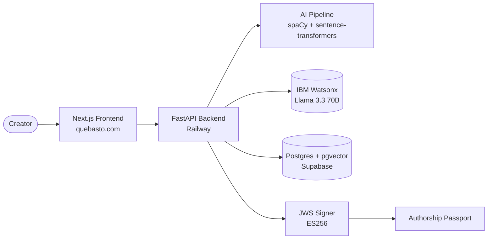

# AutorIA — Your Authorial Voice, Preserved by AI

[](LICENSE)
[](https://ibm.biz/university-bob)
[](https://www.ibm.com/products/watsonx-ai)
[](https://www.python.org/)
[](https://nextjs.org/)
[](https://fastapi.tiangolo.com/)
[](https://github.com/pgvector/pgvector)
[](https://aibuilderschallenge-bob.bemyapp.com)
[](https://quebasto.com)

> AutorIA learns an author's stylistic DNA from their prior work, generates AI assistance that preserves their voice, and issues a cryptographically signed **Authorship Passport** documenting what was AI, what was human, and what sources were referenced — complying with **EU AI Act Article 50**.

---

## 🎬 Try it live

|                       | URL                                                            |
| --------------------- | -------------------------------------------------------------- |
| **Live app**          | **[https://quebasto.com](https://quebasto.com)**               |
| **Passport verifier** | **[https://quebasto.com/verify](https://quebasto.com/verify)** |
| **API docs (local)**  | `http://localhost:8000/docs` after `make back`                 |

**Suggested 90-second walkthrough:**

1. Open [quebasto.com](https://quebasto.com) → pick **Charles Dickens**.
2. Inspect the **Style DNA** panel (radar + UMAP 2D map + distinctive vocabulary).
3. Prompt e.g. _"Write a paragraph about a foggy London evening in the 1840s"_.
4. Compare **vanilla Llama 3.3** vs **AutorIA (Dickens voice)** — fit scores and metrics update side by side.
5. Download the **Authorship Passport** → paste it into [`/verify`](https://quebasto.com/verify) → signature ✓.

Preloaded voices: **Jane Austen**, **Charles Dickens**, **Edgar Allan Poe**. You can also upload a new author live (`.txt` / `.md`); the three demo voices are protected from accidental deletion.

---

## ❓ The Problem

When a writer uses generative AI for assistance, **something is lost: their voice**. ChatGPT, Claude, Llama — they all write in the same averaged tone, optimized to please everyone. The result is aesthetic conformism in a field that lives off distinctiveness.

And starting **August 2026**, [EU AI Act Article 50](https://artificialintelligenceact.eu/article/50/) mandates that AI-generated or AI-assisted content be clearly identified, with traceable records. Creators, agencies and publishers have **no standard solution** for disclosing and verifying AI use today.

---

## 💡 Our Solution

AutorIA is the authorship layer for AI-assisted creators. Three pieces:

1. **Style DNA Extraction** — ingest an author's corpus, extract a quantifiable `StyleProfile` (lexical, syntactic, stylistic, semantic + distinctive vocabulary).
2. **Conditioned Generation** — given a prompt, generate text that preserves the author's voice (compared side-by-side with the vanilla model output).
3. **Authorship Passport** — every generation is bundled with a cryptographically signed JSON manifest, verifiable by anyone with the public key.

---

## ✅ What we shipped (MVP delivered)

End-to-end product, deployed and demoable:

| Area                    | Delivered                                                                                                                                                                                              |
| ----------------------- | ------------------------------------------------------------------------------------------------------------------------------------------------------------------------------------------------------ |
| **Corpus & onboarding** | 3 Project Gutenberg authors seeded; live `.txt`/`.md` upload; async chunking + embedding + StyleProfile recompute; delete live-added authors (demo voices protected)                                   |
| **Style DNA**           | Full `StyleProfile v1.0`: lexical / syntactic / stylistic features (spaCy), Jeffreys log-odds distinctive vocab, 768-dim semantic centroid, server-side UMAP 2D (auto-recomputed on author add/remove) |
| **Generation**          | Parallel vanilla vs conditioned calls on IBM Watsonx `meta-llama/llama-3-3-70b-instruct`; RAG top-k passages from pgvector; calibrated 5-component `fit_score` (0–100)                                 |
| **Passport**            | JWS ES256 signed Authorship Passport; public JWKS; download + online `/verify` screen                                                                                                                  |
| **Studio UI**           | Author gallery, Style DNA (radar + scatter + vocab), side-by-side studio with comparative metrics & distinctive-vocab highlights, Passport card                                                        |
| **Infra**               | Supabase (Postgres + pgvector), Railway (FastAPI + AI pipeline), Vercel (Next.js) → **https://quebasto.com**                                                                                           |
| **Quality**             | GitHub Actions CI (lint + tests), pytest + Vitest, OpenAPI contract in `docs/api_contract.yaml`                                                                                                        |
| **IBM Bob**             | 4 Custom Modes + 26+ BobShell session exports under [`bob/`](bob/)                                                                                                                                     |

---

## 🗺️ Challenge Theme Alignment

> _"Reimagine Creative Industries with AI"_ — AI Builders Challenge, July 2026.

AutorIA helps individual creators **preserve their authentic voice** when using AI, instead of being homogenized by averaged-out LLM outputs. And it gives the creative industry — agencies, publishers, regulators — the **technical infrastructure** needed to comply with the EU AI Act's disclosure requirements.

| Criterion               | How AutorIA delivers                                                                                                                         |
| ----------------------- | -------------------------------------------------------------------------------------------------------------------------------------------- |
| **Technical Execution** | Full AI pipeline (spaCy + sentence-transformers + Watsonx) + real cryptographic signing (JWS ES256) + Postgres + pgvector with HNSW indexing |
| **Innovation**          | The "auditable authorship" layer is novel — almost nobody is building this in time for EU AI Act                                             |
| **Feasibility**         | Focused MVP, mainstream stack, live deploy at [quebasto.com](https://quebasto.com), clear path to scale                                      |
| **Challenge Fit**       | Solves a concrete, named, urgent problem in a creative industry                                                                              |
| **Real-World Impact**   | EU AI Act creates urgent demand (€14B AI-assisted creative market, August 2026 deadline)                                                     |

---

## 🏗️ Architecture

See **[docs/architecture.md](docs/architecture.md)** for the full C4 diagrams (Context, Container, Component) and sequence diagrams.

High-level:


```mermaid
graph LR
    User([Creator]) --> Web[Next.js Frontend<br/>quebasto.com]
    Web --> API[FastAPI Backend<br/>Railway]
    API --> Pipeline[AI Pipeline<br/>spaCy + sentence-transformers]
    API --> Watsonx[(IBM Watsonx<br/>Llama 3.3 70B)]
    API --> DB[(Postgres + pgvector<br/>Supabase)]
    API --> Signer[JWS Signer<br/>ES256]
    Signer --> Passport[Authorship Passport]
```

**Public API surface** (full OpenAPI → [`docs/api_contract.yaml`](docs/api_contract.yaml)):

```
GET    /api/authors
GET    /api/authors/{author_id}/style-profile
POST   /api/authors/{author_id}/documents
POST   /api/authors/{author_id}/style-profile/recompute
DELETE /api/authors/{author_id}
POST   /api/generate
POST   /api/passports/verify
GET    /.well-known/jwks.json
```

---

## 🧬 How It Works — AI Pipeline

The `StyleProfile v1.0` captures an author's stylistic DNA across orthogonal layers:

| Layer                      | Examples                                                          | File                                                       |
| -------------------------- | ----------------------------------------------------------------- | ---------------------------------------------------------- |
| **Lexical**                | Type-Token Ratio, MATTR-500, hapax ratio, avg word length         | `ai_pipeline/autoria_ai/extractor/lexical.py`              |
| **Syntactic**              | Sentence length distribution, subordination ratio, dep-tree depth | `ai_pipeline/autoria_ai/extractor/syntactic.py`            |
| **Stylistic**              | Punctuation & POS distribution, discourse markers, dialogue ratio | `ai_pipeline/autoria_ai/extractor/stylistic.py`            |
| **Distinctive Vocabulary** | Top-30 terms vs the other authors (Jeffreys log-odds-ratio)       | `ai_pipeline/autoria_ai/extractor/vocabulary.py`           |
| **Semantic**               | Author centroid (768-dim) + UMAP 2D projection                    | `ai_pipeline/autoria_ai/embedder.py` + `umap_projector.py` |

Full feature spec → **[docs/style_features.md](docs/style_features.md)**.

When the user prompts a generation, the system runs **two parallel Watsonx calls**: one vanilla and one conditioned on the StyleProfile + RAG passages. Both outputs are scored against the target StyleProfile via a 5-component weighted `fit_score`. The conditioned generation is then bundled into a signed **Authorship Passport** (see **[docs/passport_schema.md](docs/passport_schema.md)**).

---

## 🔐 The Authorship Passport

Every generation emits a JSON manifest signed with **JWS (ES256)**, containing:

- Hash of the input prompt (privacy-preserving)
- Hash of the output text (tamper-evident)
- Model identifier and parameters
- Hashes of the RAG source passages used
- AI / human contribution percentages
- `fit_score` against the target StyleProfile

The signature can be verified **publicly and offline** against the AutorIA public key at `/.well-known/jwks.json` — no AutorIA service required. Online verification is also available at **[quebasto.com/verify](https://quebasto.com/verify)**.

→ Full spec: **[docs/passport_schema.md](docs/passport_schema.md)**.

---

## 🤖 How We Used IBM Bob

We built AutorIA in ~30 days with IBM Bob as our main copilot. Four Custom Modes — one per technical pillar — orchestrated different parts of the development cycle:

| Custom Mode             | Purpose                                                                                  | Doc                                                                                    |
| ----------------------- | ---------------------------------------------------------------------------------------- | -------------------------------------------------------------------------------------- |
| **StyleExtractor**      | Building the linguistic feature extractor with spaCy                                     | [`bob/custom-modes/style-extractor.md`](bob/custom-modes/style-extractor.md)           |
| **GenerationConductor** | RAG retrieval, conditioned-prompt composition, Watsonx orchestration, `fit_score` tuning | [`bob/custom-modes/generation-conductor.md`](bob/custom-modes/generation-conductor.md) |
| **StudioComposer**      | Style DNA viz, side-by-side UI, `/verify` screen, API contract alignment, i18n           | [`bob/custom-modes/studio-composer.md`](bob/custom-modes/studio-composer.md)           |
| **PassportAuditor**     | Designing and verifying the JWS-signed Passport                                          | [`bob/custom-modes/passport-auditor.md`](bob/custom-modes/passport-auditor.md)         |

BobShell session exports live in **[`bob/sessions/`](bob/sessions/)** (Sprint 1 + Sprint 2, all three owners — **26+ exports**).

The Bob usage report lives in **[`bob/usage-report.md`](bob/usage-report.md)**. Our operational playbook (prompt patterns, export workflow, anti-patterns) is in **[`bob/playbook.md`](bob/playbook.md)**.

---

## ⚙️ Tech Stack

| Layer           | Tech                                                                                                                               | Why                                                                                |
| --------------- | ---------------------------------------------------------------------------------------------------------------------------------- | ---------------------------------------------------------------------------------- |
| **Frontend**    | Next.js 16 (App Router) + React 19 + TypeScript + Tailwind v4 + shadcn/ui + Recharts                                               | Modern React, fast SSR, strong DX for Style DNA visualizations                     |
| **Backend**     | FastAPI + Python 3.11 + Pydantic v2 + SQLAlchemy 2 + asyncpg / supabase-py                                                         | Async by default, type-safe, fits a Python AI pipeline natively                    |
| **AI Pipeline** | spaCy 3.7 (`en_core_web_lg`) + sentence-transformers (`all-mpnet-base-v2`) + scikit-learn + umap-learn                             | Industry-standard English NLP; strong 768-dim semantic embeddings; reproducible    |
| **LLM**         | IBM Watsonx (`meta-llama/llama-3-3-70b-instruct`) — sole model in use; `ibm/granite-4-h-small` declared as an unexercised fallback | Every generation runs on IBM Watsonx; honest A/B (same model ± style conditioning) |
| **Database**    | PostgreSQL 16 + pgvector (Supabase)                                                                                                | Single DB for relational + vector; HNSW index for fast RAG                         |
| **Crypto**      | python-jose, ES256 (ECDSA P-256)                                                                                                   | Standard JWS; small signatures; native browser verification                        |
| **Hosting**     | Vercel (frontend) + Railway (backend) + Supabase (DB) → **[quebasto.com](https://quebasto.com)**                                   | Zero-ops deploy with custom domain                                                 |
| **Dev tools**   | IBM Bob + GitHub + GitHub Projects + GitHub Actions + Docker Compose                                                               | Bob is mandatory; the rest is best-in-class CI/CD for this size                    |

---

## 🚀 Getting Started (Local Setup)

> **Judges / reviewers:** the fastest path is the live app at **[https://quebasto.com](https://quebasto.com)**. Use the steps below only if you want to run the full stack on your machine.

### Prerequisites

- **Python 3.11**
- **Node 20+**
- **Docker Desktop** (local Postgres + pgvector)
- **Make** (optional but recommended)
  - Windows: `winget install GnuWin32.Make`, or use WSL / run the underlying commands from the `Makefile` by hand
- An **IBM Watsonx** API key + project (required for live generation)

### Quick start

```bash
# 1. Clone
git clone https://github.com/sergi-torres/autorIA.git
cd autorIA

# 2. Copy env templates and fill in real values (Watsonx, Supabase / DATABASE_URL)
cp .env.example .env
# Next.js reads env from frontend/, not the repo root:
cp frontend/.env.local.example frontend/.env.local

# 3. Install all dependencies (Python editable installs + spaCy model + npm)
make install

# 4. Generate Authorship Passport signing keypair (one-time)
make keys

# 5. Start local Postgres + pgvector
make db-up

# 6. Seed the database: raw text + embeddings + style profiles
make seed-full
# ⚠️  Slow on first run — downloads ~980 MB of ML models:
#     • all-mpnet-base-v2  (~420 MB, sentence-transformers)
#     • en_core_web_lg     (~560 MB, spaCy)
# If you only need raw text without profiles/embeddings, use `make seed` instead.

# 7. Start backend and frontend in two terminals
make back    # FastAPI  → http://localhost:8000  (OpenAPI at /docs)
make front   # Next.js  → http://localhost:3000
```

`make dev` starts the DB and prints the same two-terminal reminder.

### Minimal env checklist

Fill at least these in `.env` / `frontend/.env.local` (see [`.env.example`](.env.example)):

| Variable                                                 | Where                 | Purpose                                         |
| -------------------------------------------------------- | --------------------- | ----------------------------------------------- |
| `DATABASE_URL`                                           | root `.env`           | Local Docker Postgres or Supabase pooler        |
| `SUPABASE_URL` / `SUPABASE_KEY`                          | root `.env`           | Backend DB access (`service_role` locally/prod) |
| `WATSONX_API_KEY` / `WATSONX_URL` / `WATSONX_PROJECT_ID` | root `.env`           | Live generation                                 |
| `PASSPORT_*_KEY_PATH` (or `*_PEM`) + `PASSPORT_KID`      | root `.env`           | Passport signing (`make keys`)                  |
| `NEXT_PUBLIC_API_BASE_URL`                               | `frontend/.env.local` | Usually `http://localhost:8000`                 |
| `AUTORIA_CORS_ORIGINS`                                   | root `.env`           | Include `http://localhost:3000`                 |

Smoke-check secrets (booleans only): `GET http://localhost:8000/internal/env-check`.

### Pipeline-only demo (no web stack)

```bash
make demo
```

### Tests & lint

```bash
make test
make lint
```

> Local `.venv` day-to-day setup is **not** a byte-for-byte copy of the Railway image. Known traps (editable installs across worktrees, torch CPU vs CUDA resolution, lint pin drift) are documented in **[docs/LOCAL_DEV.md](docs/LOCAL_DEV.md)**. Production deploy notes: **[docs/DEPLOYMENT.md](docs/DEPLOYMENT.md)**.

---

## 🗂️ Repository Structure

```
autorIA/
├── ai_pipeline/         # CORE — feature extraction, generation, passport (P2)
├── backend/             # FastAPI app + routes + DB layer (P3)
├── frontend/            # Next.js 16 app (P1)
├── bob/                 # IBM Bob workspace: Custom Modes + sessions + report
├── corpus/              # Demo texts (Austen, Dickens, Poe)
├── docs/                # MVP, decision log, architecture, schemas, local/deploy guides
├── infra/               # Supabase SQL migrations
├── scripts/             # seed, run_demo, generate_keys, UMAP precompute, etc.
├── keys/                # Public JWKS sample (private PEMs are gitignored)
├── .github/             # CI workflow, PR & issue templates
├── docker-compose.yml   # Local Postgres + pgvector
├── Makefile             # Common commands
└── README.md            # ← you are here
```

---

## 🗺️ Roadmap (post-July)

- **v1.1** — human-edit tracking + real human/AI contribution percentage in Passport
- **v1.2** — multi-step Passport (chains of generations)
- **v2.0** — multimodal (images and audio) + W3C Verifiable Credentials format
- **v2.x** — collaborative voices, voice marketplace, plug-ins for major writing apps

---

## 🙏 Acknowledgments

- **IBM Bob** — our development copilot.
- **IBM Watsonx** — LLM infrastructure.
- **BeMyApp** — challenge organizers.
- **Project Gutenberg** — public-domain corpus source (Austen, Dickens, Poe).
- Open-source libraries that made this possible: **spaCy**, **sentence-transformers**, **FastAPI**, **Next.js**, **pgvector**, **python-jose**, **shadcn/ui**, **Recharts**, **UMAP**.

---

## 👥 Team

|     | Name         | Role                             | GitHub                                          | LinkedIn                                                         |
| --- | ------------ | -------------------------------- | ----------------------------------------------- | ---------------------------------------------------------------- |
| P1  | Sergi Torres | Frontend + Pitch + Bob Champion  | [sergi-torres](https://github.com/sergi-torres) | [LinkedIn](https://www.linkedin.com/in/storres-dev/)             |
| P2  | David Muñoz  | AI/ML Engineer                   | [Davisuco28](https://github.com/Davisuco28)     | [LinkedIn](https://www.linkedin.com/in/dmunoz-dev/)              |
| P3  | Pablo Chaume | Backend + AI Generation + Crypto | [PabloVc-77](https://github.com/PabloVc-77)     | [LinkedIn](https://www.linkedin.com/in/pablo-v-chaume-magraner/) |

---

## 📜 License

MIT — see [LICENSE](LICENSE).
