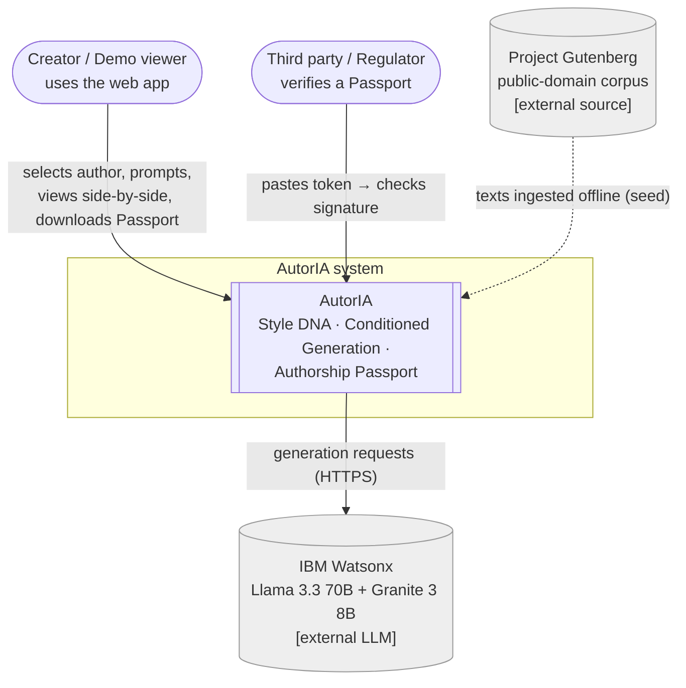
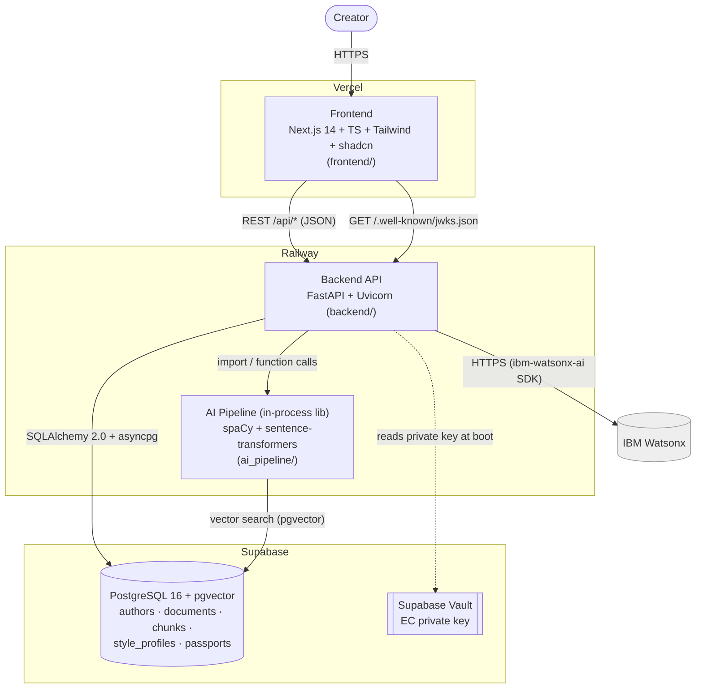
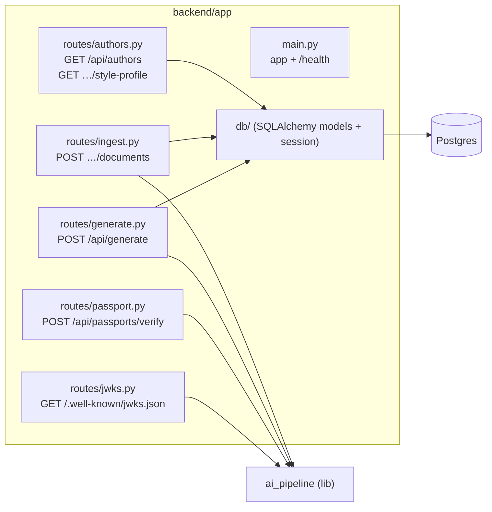
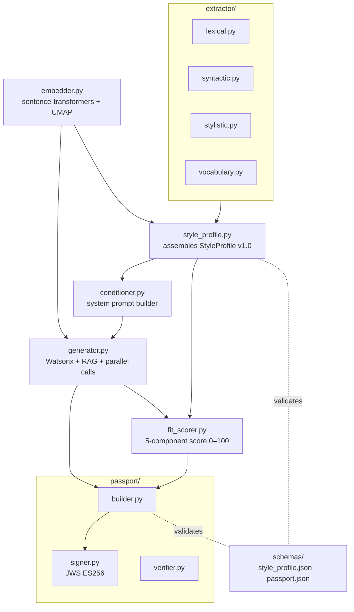
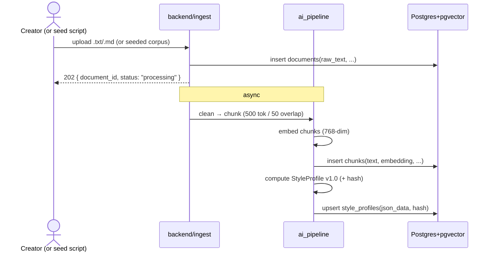
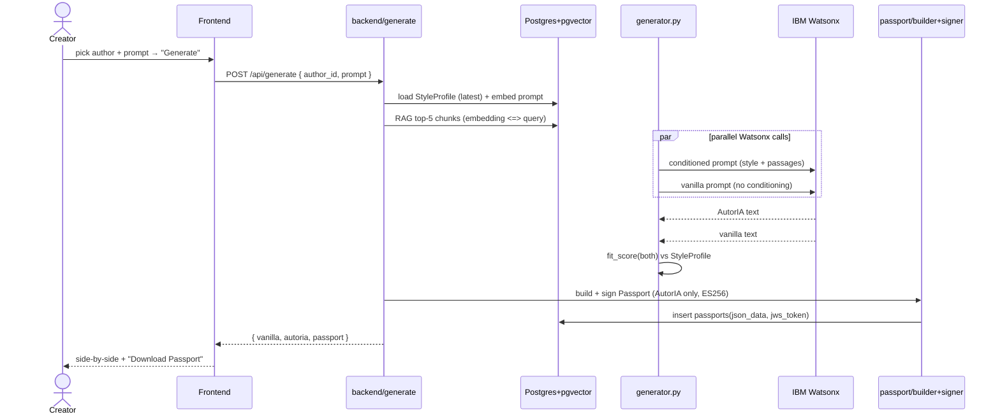
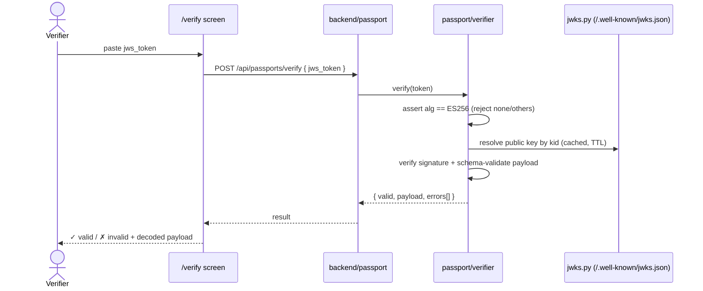
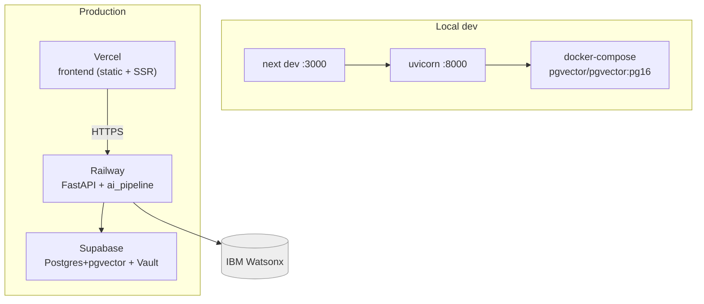

# AutorIA — Architecture

> **Status**: draft for Sprint 0 · **Owners**: P1 (frontend), P2 (pipeline), P3 (backend/crypto) · **Last updated**: 2026-06-29
> **Related specs**: [`docs/MVP.md`](MVP.md) · [`docs/api_contract.yaml`](api_contract.yaml) · [`docs/erd.md`](erd.md) · [`docs/passport_schema.md`](passport_schema.md)

This document describes the architecture of AutorIA using the **C4 model**
(Context → Container → Component) plus the key **sequence diagrams** and a
**deployment view**. All diagrams are Mermaid and render directly on GitHub.

If a diagram disagrees with the locked scope in `MVP.md`, MVP.md wins — update
this file.

---

## 0. One-paragraph summary

AutorIA is a **Next.js frontend** talking to a **FastAPI backend** over the
contract in `api_contract.yaml`. The backend wraps a Python **AI pipeline**
(spaCy + sentence-transformers) and **IBM Watsonx** (Llama 3.3 70B), persists to
**Postgres + pgvector** (Supabase), and signs an **Authorship Passport** (JWS
ES256) for every conditioned generation. Anyone can verify a Passport offline
against the public key at `/.well-known/jwks.json`.

---

## 1. C4 Level 1 — System Context

*Who/what uses AutorIA, and what AutorIA depends on.*



**Actors**
- **Creator / demo viewer** — selects an author, submits a prompt, reads the
  vanilla-vs-AutorIA comparison, downloads the Passport. No login (no accounts).
- **Verifier** — anyone checking a Passport's authenticity (the EU AI Act Art. 50
  audience). Only needs the token + public JWKS.

**External dependencies**
- **IBM Watsonx** — the LLM provider (creative + auxiliary models). The only
  hard runtime external dependency for generation.
- **Project Gutenberg** — source of the three preloaded corpora; used **offline**
  during seeding, not at request time.

---

## 2. C4 Level 2 — Container

*The deployable/runnable units and how they communicate.*



| Container | Tech | Responsibility | Host |
|---|---|---|---|
| **Frontend** | Next.js 14, TypeScript, Tailwind, shadcn/ui, Recharts, D3 | UI: author selector, Style DNA viz, side-by-side, `/verify` | Vercel |
| **Backend API** | FastAPI, Uvicorn, Pydantic v2, SQLAlchemy 2.0 + asyncpg | HTTP contract, orchestration, persistence, signing | Railway |
| **AI Pipeline** | spaCy 3.7, sentence-transformers, scikit-learn, umap-learn, tiktoken, python-jose | Extraction, embeddings, RAG, conditioned generation, fit_score, Passport build/sign/verify | in-process with backend |
| **Database** | Postgres 16 + pgvector | Relational + vector storage; HNSW RAG index | Supabase |
| **Vault** | Supabase Vault | Stores the EC private signing key | Supabase |

> The AI pipeline is a **library imported by the backend**, not a separate
> service — one fewer moving part for a 30-day MVP. It could be extracted into
> its own service later without changing the public API.

---

## 3. C4 Level 3 — Component

### 3.1 Backend (`backend/app/`)



### 3.2 AI Pipeline (`ai_pipeline/autoria_ai/`)



Mapping of components to specs:
- `extractor/*` + `embedder.py` + `style_profile.py` → **StyleProfile v1.0** (MVP §4.2, `style_features.md`).
- `conditioner.py` + `generator.py` + `fit_scorer.py` → **Conditioned Generation** (MVP §4.3).
- `passport/*` → **Authorship Passport** ([`passport_schema.md`](passport_schema.md)).

---

## 4. Key sequences

### 4.1 Author onboarding / ingest (`POST /api/authors/{id}/documents`)



### 4.2 Conditioned generation — the core flow (`POST /api/generate`)



> Latency budget (MVP §4.3 SLA: < 8s P95): the two Watsonx calls run in parallel
> via `asyncio.gather` with per-call timeouts; everything else (RAG, scoring,
> signing) is cheap by comparison. See risk R3 in MVP §11.

### 4.3 Passport verification (`POST /api/passports/verify` + `/verify` UI)



Full normative rules: [`passport_schema.md`](passport_schema.md) §8.

---

## 5. Deployment view



| Environment | Frontend | Backend | Database |
|---|---|---|---|
| **Local** | `make front` (`:3000`) | `make back` (`:8000`) | `make db-up` (Docker pgvector) |
| **Production** | Vercel | Railway | Supabase |

Secrets (Watsonx API key/project id, DB URL, `PASSPORT_*`) come from `.env`
locally and platform secret stores in production. The EC **private** key lives
in Supabase Vault / Railway secrets — never in git (see `passport_schema.md` §6).

---

## 6. Cross-cutting concerns

| Concern | Approach |
|---|---|
| **API contract** | `docs/api_contract.yaml` (OpenAPI 3.1) is the single FE/BE contract; locked in Sprint 1. |
| **Data model** | `docs/erd.md` + `infra/supabase/migrations/0001_init.sql`. |
| **Latency** | Parallel Watsonx calls, HNSW vector index, lean system prompt (< ~1200 tok). Target < 8s P95. |
| **Security / integrity** | JWS ES256; `alg` allow-list; `kid`→JWKS resolution; private key in Vault. |
| **Privacy** | Passport stores **hashes** of prompt/output/snippets, never raw text. |
| **i18n** | All UI strings in `frontend/lib/i18n/en.ts` (English only). |
| **Quality** | Ruff + Black, ESLint + Prettier, pytest happy-path + signature roundtrip; CI on every PR. |
| **Scaling path (post-July)** | Extract `ai_pipeline` into its own service; add caching/streaming; RLS if DB is exposed to untrusted clients. |

---

## 7. Key architectural decisions (and why)

- **Monorepo, pipeline as a library.** Fewer moving parts than microservices;
  the backend imports `ai_pipeline` directly. (Decision Log, 2026-06-25.)
- **One database for relational + vector.** pgvector avoids running a separate
  vector store; HNSW gives fast RAG. (MVP §6.)
- **Same LLM for vanilla and AutorIA.** Only the system prompt differs — an
  honest, judge-credible comparison. (MVP §2.)
- **Asymmetric signing (ES256), not HMAC.** Enables public, offline verification
  — the heart of the EU AI Act Art. 50 claim. (`passport_schema.md` §1, §3.)
- **Hashes, not raw text, in Passports.** Provenance without leaking content.
```
