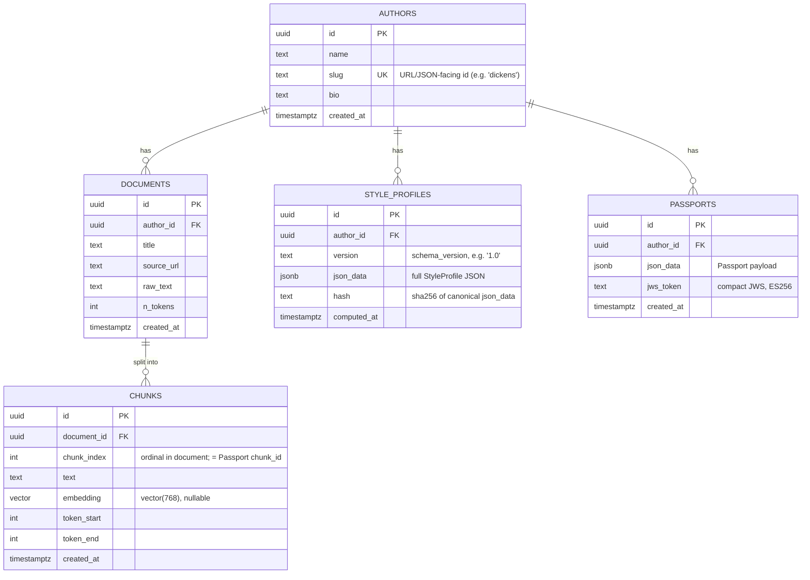

# AutorIA — Database ERD

> **Status**: draft for Sprint 0 · **Owner**: P3 · **Last updated**: 2026-06-29
> **Source of truth for the schema**: [`infra/supabase/migrations/0001_init.sql`](../infra/supabase/migrations/0001_init.sql)
> **Higher-level data model**: [`docs/MVP.md`](MVP.md) §6 (Database)

This document is the human-readable companion to the SQL migration. It explains
the five core tables, how they relate, and the design choices behind them. If
the migration and this doc ever disagree, **the migration wins** — update this
file to match.

---

## 1. Overview

AutorIA stores everything in a single **PostgreSQL 16 + pgvector** database
(hosted on Supabase). One database holds both the **relational** data (authors,
documents, generations) and the **vector** data (chunk embeddings for RAG), so
there is no separate vector store to operate.

The data flows in one direction during ingest:

```
author ─► documents ─► chunks (+ embeddings)
   │
   ├─► style_profiles   (computed from the whole corpus)
   └─► passports        (emitted per conditioned generation)
```

---

## 2. Entity–Relationship Diagram



---

## 3. Tables

### `authors`
The author "voices". Three are preloaded (Austen, Dickens, Poe); more can be
added live during the demo via `.txt`/`.md` upload (no user accounts).

| Column | Type | Notes |
|---|---|---|
| `id` | `uuid` PK | Internal id; what all foreign keys reference. |
| `name` | `text` | Display name, e.g. `Charles Dickens`. |
| `slug` | `text` UNIQUE | Stable, URL/JSON-facing id, e.g. `dickens`. |
| `bio` | `text` | Optional short description. |
| `created_at` | `timestamptz` | Defaults to `now()`. |

> **Why both `id` and `slug`?** The API and the StyleProfile/Passport JSON refer
> to an author by a readable string — `GET /api/authors/dickens`, and
> `author_id: "dickens"` inside the JSON. That readable string is the **`slug`**.
> Internally we still use a `uuid` `id` as the primary/foreign key so renames or
> duplicate names never break references. **API `author_id` ⇒ `authors.slug`.**

### `documents`
The cleaned source texts that make up a corpus (one row per work, e.g. a novel).
Gutenberg headers/footers are stripped before storage.

| Column | Type | Notes |
|---|---|---|
| `id` | `uuid` PK | |
| `author_id` | `uuid` FK → `authors.id` | `ON DELETE CASCADE`. |
| `title` | `text` | e.g. `Great Expectations`. |
| `source_url` | `text` | Project Gutenberg URL, if any. |
| `raw_text` | `text` | Full cleaned text. |
| `n_tokens` | `int` | Approx token count (tiktoken `cl100k_base`). |
| `created_at` | `timestamptz` | |

### `chunks`
~500-token slices of a document (overlap 50), each with a 768-dim embedding.
**This is the table RAG searches** to find the top-5 passages for a prompt.

| Column | Type | Notes |
|---|---|---|
| `id` | `uuid` PK | |
| `document_id` | `uuid` FK → `documents.id` | `ON DELETE CASCADE`. |
| `chunk_index` | `int` | Ordinal within the document. Unique per `(document_id, chunk_index)`. Referenced by the Passport as `rag_sources[].chunk_id`. |
| `text` | `text` | The chunk content. |
| `embedding` | `vector(768)` | sentence-transformers `all-mpnet-base-v2`. **Nullable** so chunks can be inserted first and embedded asynchronously. |
| `token_start` / `token_end` | `int` | Span of the chunk within the document. |
| `created_at` | `timestamptz` | |

### `style_profiles`
The versioned "stylistic DNA" (StyleProfile JSON v1.0 — see MVP §4.2). Stored as
`jsonb` so the whole profile is queryable. Recomputes **append** a new row; the
*current* profile for an author is the one with the latest `computed_at`.

| Column | Type | Notes |
|---|---|---|
| `id` | `uuid` PK | |
| `author_id` | `uuid` FK → `authors.id` | `ON DELETE CASCADE`. |
| `version` | `text` | `schema_version`, e.g. `1.0`. |
| `json_data` | `jsonb` | The full StyleProfile JSON. |
| `hash` | `text` | sha256 of the canonical JSON; mirrored in the Passport as `author_voice.style_profile_hash` for tamper-evidence. |
| `computed_at` | `timestamptz` | |

### `passports`
One row per issued **Authorship Passport** (MVP §4.4). Stores both the JSON
payload and its signed token so verification is fully reproducible offline.

| Column | Type | Notes |
|---|---|---|
| `id` | `uuid` PK | Maps to the `passport_id` (UUID v4) in the JSON. |
| `author_id` | `uuid` FK → `authors.id` | `ON DELETE CASCADE`. |
| `json_data` | `jsonb` | The Passport payload. |
| `jws_token` | `text` | Compact JWS signed with **ES256** (ECDSA P-256). |
| `created_at` | `timestamptz` | |

---

## 4. Relationships & cascade behaviour

| Parent | Child | Cardinality | On delete |
|---|---|---|---|
| `authors` | `documents` | 1 → many | cascade |
| `authors` | `style_profiles` | 1 → many (history) | cascade |
| `authors` | `passports` | 1 → many | cascade |
| `documents` | `chunks` | 1 → many | cascade |

Deleting an author removes its whole footprint (documents, chunks, profiles,
passports). This keeps "remove an author" a single, clean operation.

---

## 5. Indexes

| Index | Table | Purpose |
|---|---|---|
| `authors_slug_key` (UNIQUE) | `authors(slug)` | Fast lookup by the API-facing slug. |
| `documents_author_id_idx` | `documents(author_id)` | List/join a corpus by author. |
| `chunks_document_id_idx` | `chunks(document_id)` | Fetch all chunks of a document. |
| `chunks_embedding_hnsw_idx` | `chunks(embedding)` | **HNSW** ANN search, `vector_cosine_ops`. The core RAG index. |
| `style_profiles_author_id_computed_at_idx` | `style_profiles(author_id, computed_at desc)` | Get the latest profile per author. |
| `passports_author_id_idx` | `passports(author_id)` | List passports by author. |

### Vector search

The HNSW index uses **cosine distance** (operator `<=>`) to match how the
`fit_score` compares generations to the author's semantic centroid (MVP §4.2).
Typical retrieval query:

```sql
select id, document_id, chunk_index, text
from public.chunks
order by embedding <=> $1   -- $1 = query embedding (vector(768))
limit 5;
```

Build parameters: `m = 16`, `ef_construction = 64` (sensible defaults for a
corpus of this size). Recall can be tuned at query time with
`set hnsw.ef_search = <n>;`.

---

## 6. Notes & conventions

- **Schema-only migration.** `0001_init.sql` creates structure only. Author
  metadata and corpus content are loaded by the seed step (`make seed` →
  `scripts/seed`), keeping schema and data concerns separate.
- **UUID keys** via `gen_random_uuid()` (from `pgcrypto`). The API exposes
  authors by `slug`, not by raw UUID.
- **`jsonb` for evolving shapes.** StyleProfile and Passport payloads live as
  `jsonb` so the schema versions independently of the DB (`version` /
  `schema_version` fields), avoiding a migration for every field tweak.
- **Hashes, not raw text, in Passports.** The Passport stores hashes of the
  prompt/output/snippets (privacy-preserving); the DB simply persists that JSON.
- **Row Level Security (RLS).** Not enabled in this MVP — there are no user
  accounts and the backend connects with a privileged role (SQLAlchemy + asyncpg
  / Supabase service key). If the tables were ever exposed directly via Supabase
  PostgREST to untrusted clients, RLS policies would be added in a later
  migration.

---

## 7. Future migrations (post-July, not in scope now)

Tracked here so the numbering stays predictable:

- `000X_human_edit_tracking.sql` — real human/AI % + edit history (Passport v1.1).
- `000X_passport_chains.sql` — link passports into multi-step generation chains.
- `000X_rls_policies.sql` — RLS if/when the DB is exposed to untrusted clients.
