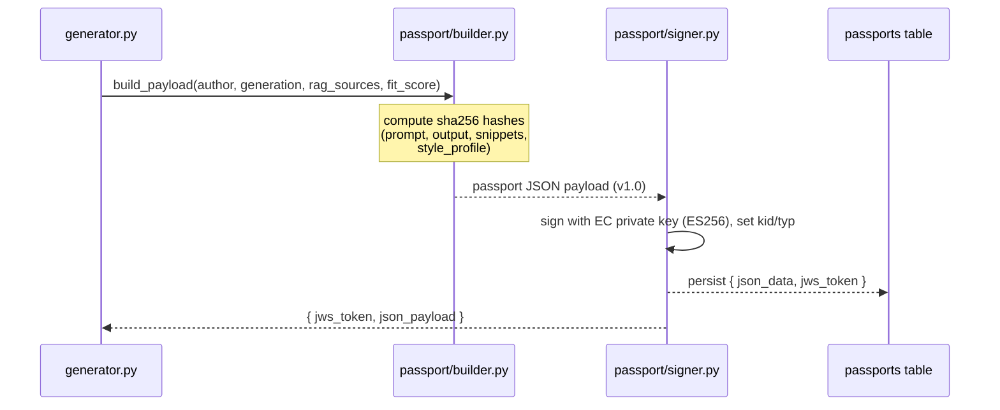
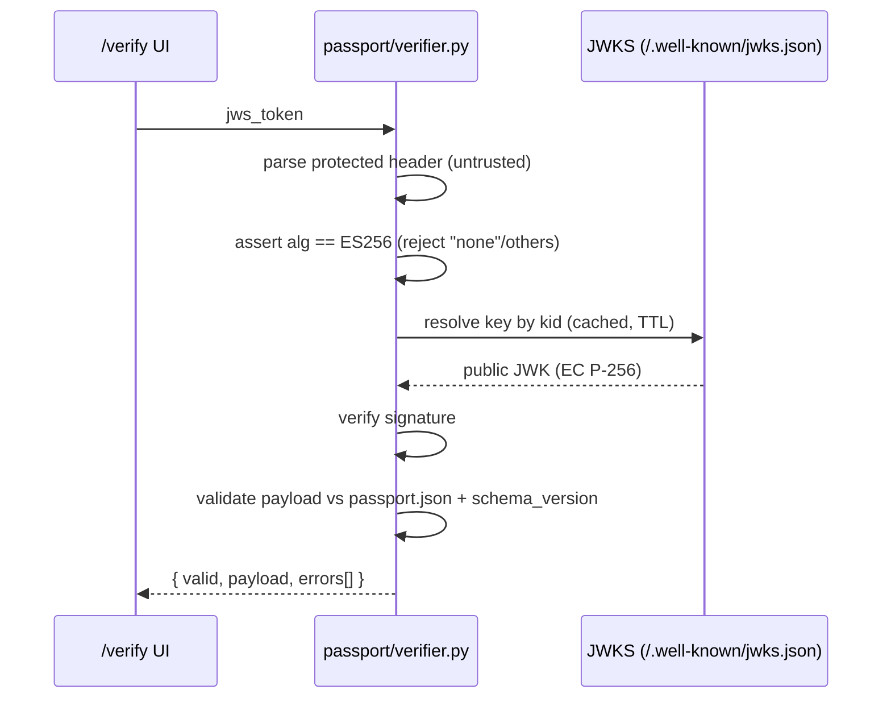

# AutorIA — Authorship Passport Specification

> **Status**: draft for Sprint 0 · **Owner**: P3 (Backend + Crypto) · **Pairs with**: P1 (`/verify` UI) · **Last updated**: 2026-06-29
> **Schema version**: `1.0`
> **Authoritative companions**:
> - JSON Schema → `ai_pipeline/autoria_ai/schemas/passport.json` (to be generated from this doc)
> - Code → `ai_pipeline/autoria_ai/passport/{builder,signer,verifier}.py`
> - Routes → `backend/app/routes/passport.py`, `backend/app/routes/jwks.py`
> - Keys → `scripts/generate_keys.py`
> - Storage → `passports` table (see [`docs/erd.md`](erd.md))
> - Locked source schema → [`docs/MVP.md`](MVP.md) §4.4

This is the **precise specification** of the Authorship Passport: its JSON
payload, how it is signed (JWS / ES256), how keys are managed and published
(JWKS), and the exact algorithm a verifier must follow. If this document and the
code/JSON Schema disagree, **treat this document as the spec and fix the code** —
unless a change is recorded here with a new schema version.

---

## 1. What the Authorship Passport is (and why)

When AutorIA generates a piece of text in an author's voice, it also emits a
**tamper-evident JSON certificate** stating *what* was generated, *by which
model*, *from which sources*, and *how human-vs-AI* the result is. The
certificate is **cryptographically signed** so that **anyone can verify it
offline**, using only AutorIA's public key — no trust in our servers required.

This is AutorIA's **EU AI Act Article 50** angle: Art. 50 requires AI-generated
or AI-assisted content to be clearly disclosed and traceable. The Passport is
the machine-verifiable disclosure record.

**Two privacy/integrity principles drive the whole design:**

1. **Store hashes, never raw content.** The Passport proves provenance of a
   prompt/output/source *without leaking the text itself*. We persist
   `sha256` digests, not the strings.
2. **Verifiable without us.** Verification needs only the compact JWS token and
   the public JWKS. There is no "call home" step.

---

## 2. Lifecycle

### 2.1 Issuance (on every `POST /api/generate`)



The signed token plus the JSON payload are returned inside the `/api/generate`
response (`passport` field) and stored in the `passports` table.

### 2.2 Verification (on `POST /api/passports/verify` and in the `/verify` UI)



---

## 3. The signed object: compact JWS

A Passport "token" is a **compact JWS** (RFC 7515): three base64url segments
joined by dots.

```
BASE64URL(protected_header) . BASE64URL(payload) . BASE64URL(signature)
```

### 3.1 Protected header

```json
{
  "alg": "ES256",
  "typ": "passport+jws",
  "kid": "autoria-2026-07"
}
```

| Field | Value | Notes |
|---|---|---|
| `alg` | `ES256` | **Only** accepted algorithm (ECDSA P-256 + SHA-256). Anything else — including `none`, `HS256`, `RS256` — MUST be rejected (prevents algorithm-confusion attacks). |
| `typ` | `passport+jws` | Media-type hint identifying this as an AutorIA Passport. |
| `kid` | key id | Identifies which public key in the JWKS signed this. Convention: `autoria-<YYYY-MM>` of key creation. |

### 3.2 Payload

The payload is the **Passport JSON** defined in §4. (We sign the JSON object
directly; the Passport is a signed manifest, not a claims-style JWT — it has no
`exp`/`iss`/`aud` and does not expire in v1.)

---

## 4. Payload schema — `1.0`

Decoded payload of the JWS:

```json
{
  "schema_version": "1.0",
  "passport_id": "550e8400-e29b-41d4-a716-446655440000",
  "generated_at": "2026-07-15T10:32:11Z",
  "author_voice": {
    "id": "dickens",
    "style_profile_hash": "sha256:9f2c…",
    "style_profile_version": "1.0"
  },
  "generation": {
    "model_provider": "ibm/watsonx",
    "model_id": "meta-llama/llama-3-3-70b-instruct",
    "user_prompt_hash": "sha256:1a3b…",
    "output_hash": "sha256:c7d9…",
    "output_length_tokens": 312
  },
  "rag_sources": [
    { "doc_id": "great_expectations", "chunk_id": 42, "snippet_hash": "sha256:4e5f…" }
  ],
  "contribution": {
    "human_pct": 0,
    "ai_pct": 100,
    "note": "v1: 100% AI-assisted. Human-edit tracking is in the roadmap."
  },
  "fit_score": 87,
  "verifier_url": "https://autoria.vercel.app/verify"
}
```

### 4.1 Field reference

| Path | Type | Required | Description |
|---|---|---|---|
| `schema_version` | string | ✅ | Passport schema version. `"1.0"` for July. Drives forward-compat in the verifier. |
| `passport_id` | string (UUID v4) | ✅ | Unique id. Persisted as `passports.id`. |
| `generated_at` | string (ISO-8601, UTC, `Z`) | ✅ | Issuance timestamp. |
| `author_voice.id` | string | ✅ | The author **slug** (e.g. `dickens`) — equals `authors.slug` / the API `author_id`. |
| `author_voice.style_profile_hash` | string (`sha256:<hex>`) | ✅ | Hash of the StyleProfile used. MUST equal `style_profiles.hash` for that profile (see [`docs/erd.md`](erd.md)). Lets a verifier pin the exact "voice" used. |
| `author_voice.style_profile_version` | string | ✅ | The StyleProfile `schema_version` (e.g. `1.0`). |
| `generation.model_provider` | string | ✅ | Fixed `ibm/watsonx` for July. |
| `generation.model_id` | string | ✅ | e.g. `meta-llama/llama-3-3-70b-instruct`. |
| `generation.user_prompt_hash` | string (`sha256:<hex>`) | ✅ | Hash of the user prompt. **Never** the raw prompt (privacy). |
| `generation.output_hash` | string (`sha256:<hex>`) | ✅ | Hash of the generated text — makes the Passport tamper-evident against the output. |
| `generation.output_length_tokens` | integer | ✅ | Token count of the output. |
| `rag_sources` | array | ✅ (may be empty) | The retrieved passages that conditioned the generation. |
| `rag_sources[].doc_id` | string | ✅ | Source document identifier (document slug/title key). |
| `rag_sources[].chunk_id` | integer | ✅ | The chunk's ordinal within its document — equals `chunks.chunk_index` (see [`docs/erd.md`](erd.md)). |
| `rag_sources[].snippet_hash` | string (`sha256:<hex>`) | ✅ | Hash of the chunk text. Proves *which* passage without exposing it. |
| `contribution.human_pct` | integer 0–100 | ✅ | v1 is always `0`. |
| `contribution.ai_pct` | integer 0–100 | ✅ | v1 is always `100`. `human_pct + ai_pct` MUST equal `100`. |
| `contribution.note` | string | ➖ | Free-text clarification. |
| `fit_score` | integer 0–100 | ✅ | Style-fit of the **AutorIA** generation against the target StyleProfile (MVP §4.2). |
| `verifier_url` | string (URL) | ➖ | Where a human can verify this Passport. Value of the deployed `/verify` page. |

> **Out of scope for v1** (see MVP §5 / roadmap): real human/AI percentages,
> human-edit tracking, multi-step passport chains. `contribution` is hard-coded
> to 100% AI in July.

---

## 5. Hashing conventions

All hash fields use the form:

```
sha256:<lowercase-hex>     e.g. sha256:9f2c1b…  (64 hex chars after the prefix)
```

| What | Hashed input |
|---|---|
| `user_prompt_hash` | The raw user prompt string, UTF-8 encoded, **unmodified**. |
| `output_hash` | The generated text string, UTF-8 encoded, **unmodified**. |
| `rag_sources[].snippet_hash` | The chunk `text` as stored in `chunks.text`, UTF-8. |
| `author_voice.style_profile_hash` | The **canonical JSON** of the StyleProfile. |

**Canonical JSON** (used for the StyleProfile hash so it is reproducible):
UTF-8, keys sorted lexicographically, no insignificant whitespace
(`json.dumps(obj, sort_keys=True, separators=(",", ":"), ensure_ascii=False)`).
The extractor that writes `style_profiles.hash` and the Passport `builder.py`
**must** use the identical canonicalization, or the hashes won't match.

---

## 6. Key management

- **Algorithm**: ECDSA on curve **P-256** with SHA-256 → JWS `ES256`.
- **Generation**: `scripts/generate_keys.py` (`make keys`) creates one EC
  keypair and a `kid` (convention `autoria-<YYYY-MM>`).
- **Private key**:
  - Local dev: a PEM file referenced by `PASSPORT_PRIVATE_KEY_PATH`.
    Lives under `keys/` which is **git-ignored** — it must **never** be
    committed, logged, or echoed in error messages.
  - Production: stored in **Supabase Vault** (or the Railway secret store),
    injected as an env var / mounted secret.
- **Public key**: published at `GET /.well-known/jwks.json` (§7) and may also be
  checked into the repo as `keys/jwks.public.json` for the `/verify` UI to bundle.

### 6.1 Environment variables

| Variable | Meaning |
|---|---|
| `PASSPORT_PRIVATE_KEY_PATH` | Path to the EC private key PEM (signing). |
| `PASSPORT_PUBLIC_KEY_PATH` | Path to the EC public key PEM (serving JWKS / local verify). |
| `PASSPORT_KID` | Key id written into the JWS header and the JWK. |
| `PASSPORT_VERIFIER_URL` | Value placed in `payload.verifier_url`. |

(Names are mirrored in `.env.example`; keep them in sync.)

---

## 7. JWKS endpoint

`GET /.well-known/jwks.json` serves the **public** key as a standard JWK Set
(RFC 7517). Response headers: `Content-Type: application/json`,
`Cache-Control: public, max-age=3600`.

```json
{
  "keys": [
    {
      "kty": "EC",
      "crv": "P-256",
      "x": "f83OJ3D2xF1Bg8vub9tLe1gHMzV76e8Tus9uPHvRVEU",
      "y": "x_FEzRu9m36HLN_tue659LNpXW6pCyStikYjKIWI5a0",
      "use": "sig",
      "alg": "ES256",
      "kid": "autoria-2026-07"
    }
  ]
}
```

- Multiple keys MAY appear (e.g. during rotation); verifiers select by `kid`.
- The endpoint exposes **only** the public key — never any private material.

---

## 8. Verification algorithm (normative)

`passport/verifier.py` and `POST /api/passports/verify` MUST implement exactly
this order, returning `{ valid: bool, payload: PassportJSON | null, errors: string[] }`:

1. **Parse** the compact JWS into header / payload / signature. On malformed
   input → `valid: false`, error `malformed_token`.
2. **Read the protected header** (do **not** trust it for anything but routing).
3. **Algorithm allow-list**: if `alg != "ES256"` → reject with
   `unsupported_alg`. Explicitly reject `none` and any MAC/RSA alg
   (algorithm-confusion defense).
4. **Resolve `kid`** against the JWKS (cached, see §8.1). Unknown `kid` →
   `unknown_kid`. (Never fall back to a key embedded in the token.)
5. **Verify the signature** with the resolved public key. Failure →
   `invalid_signature`.
6. **Schema-validate** the payload against `passport.json`. Failure →
   `schema_invalid` (include offending fields).
7. **Version check**: if `schema_version` is newer/unsupported → `valid: false`
   with `unsupported_schema_version` (we verify signatures we understand only).
   Older supported versions are accepted if still in the supported set.
8. On all checks passing → `valid: true`, return the decoded `payload`.

### 8.1 JWKS fetching & DoS hygiene

- Cache the JWKS with the endpoint TTL (`max-age`, ~1h). **Don't** cache forever.
- Apply a short HTTP timeout; if the JWKS is unreachable, fail closed with
  `jwks_unavailable` rather than hanging the request.
- In local/offline mode the verifier may load the public key from
  `PASSPORT_PUBLIC_KEY_PATH` instead of an HTTP fetch.

### 8.2 `/verify` UI error copy (P1)

| Internal error | User-facing message |
|---|---|
| `malformed_token` | "This doesn't look like a valid Authorship Passport token." |
| `unsupported_alg` | "Unsupported signature algorithm — rejected." |
| `unknown_kid` | "Signed with an unknown key. Could not verify." |
| `invalid_signature` | "Signature invalid — this Passport may have been altered." |
| `schema_invalid` | "Passport contents don't match the expected format." |
| `unsupported_schema_version` | "This Passport uses a newer format this verifier doesn't support yet." |
| `jwks_unavailable` | "Couldn't reach the key directory. Try again shortly." |

All user-facing strings live in `frontend/lib/i18n/en.ts`, not hard-coded.

---

## 9. JSON Schema (skeleton for `passport.json`)

Generate `ai_pipeline/autoria_ai/schemas/passport.json` from this (Draft 2020-12):

```json
{
  "$schema": "https://json-schema.org/draft/2020-12/schema",
  "$id": "https://autoria.app/schemas/passport-1.0.json",
  "title": "AutorIA Authorship Passport",
  "type": "object",
  "additionalProperties": false,
  "required": [
    "schema_version", "passport_id", "generated_at", "author_voice",
    "generation", "rag_sources", "contribution", "fit_score"
  ],
  "properties": {
    "schema_version": { "const": "1.0" },
    "passport_id": { "type": "string", "format": "uuid" },
    "generated_at": { "type": "string", "format": "date-time" },
    "author_voice": {
      "type": "object",
      "additionalProperties": false,
      "required": ["id", "style_profile_hash", "style_profile_version"],
      "properties": {
        "id": { "type": "string" },
        "style_profile_hash": { "type": "string", "pattern": "^sha256:[0-9a-f]{64}$" },
        "style_profile_version": { "type": "string" }
      }
    },
    "generation": {
      "type": "object",
      "additionalProperties": false,
      "required": [
        "model_provider", "model_id", "user_prompt_hash",
        "output_hash", "output_length_tokens"
      ],
      "properties": {
        "model_provider": { "type": "string" },
        "model_id": { "type": "string" },
        "user_prompt_hash": { "type": "string", "pattern": "^sha256:[0-9a-f]{64}$" },
        "output_hash": { "type": "string", "pattern": "^sha256:[0-9a-f]{64}$" },
        "output_length_tokens": { "type": "integer", "minimum": 0 }
      }
    },
    "rag_sources": {
      "type": "array",
      "items": {
        "type": "object",
        "additionalProperties": false,
        "required": ["doc_id", "chunk_id", "snippet_hash"],
        "properties": {
          "doc_id": { "type": "string" },
          "chunk_id": { "type": "integer", "minimum": 0 },
          "snippet_hash": { "type": "string", "pattern": "^sha256:[0-9a-f]{64}$" }
        }
      }
    },
    "contribution": {
      "type": "object",
      "additionalProperties": false,
      "required": ["human_pct", "ai_pct"],
      "properties": {
        "human_pct": { "type": "integer", "minimum": 0, "maximum": 100 },
        "ai_pct": { "type": "integer", "minimum": 0, "maximum": 100 },
        "note": { "type": "string" }
      }
    },
    "fit_score": { "type": "integer", "minimum": 0, "maximum": 100 },
    "verifier_url": { "type": "string", "format": "uri" }
  }
}
```

---

## 10. Storage mapping

The `passports` table (see [`docs/erd.md`](erd.md)) stores:

| Column | Source |
|---|---|
| `id` | `payload.passport_id` |
| `author_id` | FK to `authors.id` resolved from `author_voice.id` (the slug) |
| `json_data` | the decoded payload (§4) |
| `jws_token` | the compact JWS (§3) |
| `created_at` | DB default (`payload.generated_at` is the logical issuance time) |

---

## 11. Security checklist (PassportAuditor)

- [ ] `alg` allow-list = `{ES256}`; `none` and others rejected.
- [ ] `kid` resolved against live/cached JWKS; never trust a key in the token.
- [ ] JWKS cached with TTL; never forever; short timeout; fail closed.
- [ ] Schema validated; unsupported newer versions rejected.
- [ ] Only hashes in the payload — no raw prompt / output / snippet text.
- [ ] Private key never committed, logged, or in error messages.
- [ ] Roundtrip test (`ai_pipeline/tests/test_passport.py`): build → sign →
      verify → `valid: true`; plus negative tests (tampered payload, `alg:none`,
      unknown `kid`).
- [ ] An example valid Passport committed to `docs/examples/passport-valid.json`
      (after Sprint 3).

---

## 12. Versioning & change policy

- The **payload** is versioned by `schema_version`; the **JSON Schema** `$id`
  encodes the version (`passport-1.0.json`).
- Any field change ⇒ bump `schema_version`, add the new JSON Schema, and update
  the verifier's supported-versions set. Record the change here and in
  `docs/decision_log.md`.
- v1.x roadmap (not July): real `contribution` percentages + human-edit
  tracking; passport chains (linking multiple generations).
